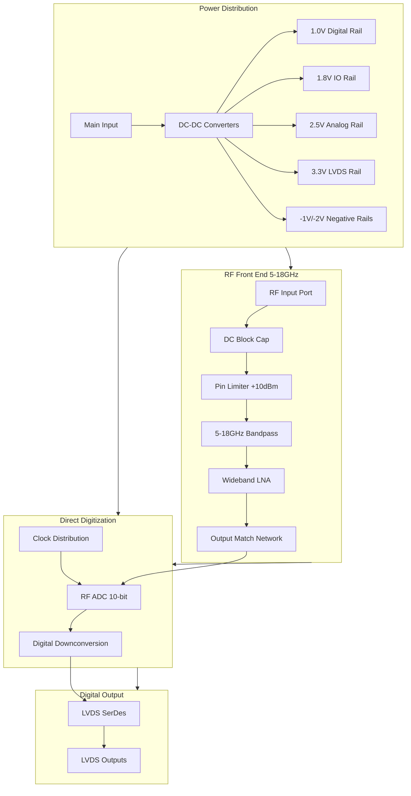

# System Architecture
## hjgjf

```mermaid
flowchart TD
    subgraph RF_Chain["RF Front End 5-18GHz"]
        RF_IN["RF Input Port"] --> DC_BLOCK["DC Block Cap"]
        DC_BLOCK --> LIMITER["Pin Limiter +10dBm"]
        LIMITER --> BANDPASS["5-18GHz Bandpass"]
        BANDPASS --> LNA["Wideband LNA"]
        LNA --> MATCH["Output Match Network"]
    end
    
    subgraph Digital_Chain["Direct Digitization"]
        MATCH --> ADC["RF ADC 10-bit"]
        CLK_GEN["Clock Distribution"] --> ADC
        ADC --> DECIM["Digital Downconversion"]
    end
    
    subgraph Power_Domain["Power Distribution"]
        MAIN_RAIL["Main Input"] --> DC_DC["DC-DC Converters"]
        DC_DC --> RAIL1["1.0V Digital Rail"]
        DC_DC --> RAIL2["1.8V IO Rail"]
        DC_DC --> RAIL3["2.5V Analog Rail"]
        DC_DC --> RAIL4["3.3V LVDS Rail"]
        DC_DC --> RAIL5["-1V/-2V Negative Rails"]
    end
    
    subgraph Data_Path["Digital Output"]
        DECIM --> SERIALIZER["LVDS SerDes"]
        SERIALIZER --> LVDS_OUT["LVDS Outputs"]
    end
    
    RF_Chain --> Digital_Chain
    Power_Domain --> Digital_Chain
    Power_Domain --> RF_Chain
    Digital_Chain --> Data_Path
```
