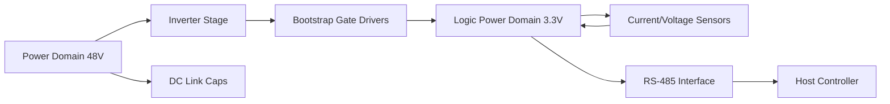

# System Architecture
## rf44

```mermaid
graph LR
    PWR[Power Domain 48V] --> INV[Inverter Stage]
    PWR --> DC[DC Link Caps]
    INV --> GATED[Bootstrap Gate Drivers]
    GATED --> MCU_LOGIC[Logic Power Domain 3.3V]
    MCU_LOGIC --> SENSE[Current/Voltage Sensors]
    MCU_LOGIC --> COMMS[RS-485 Interface]
    SENSE --> MCU_LOGIC
    COMMS --> HOST[Host Controller]
```
