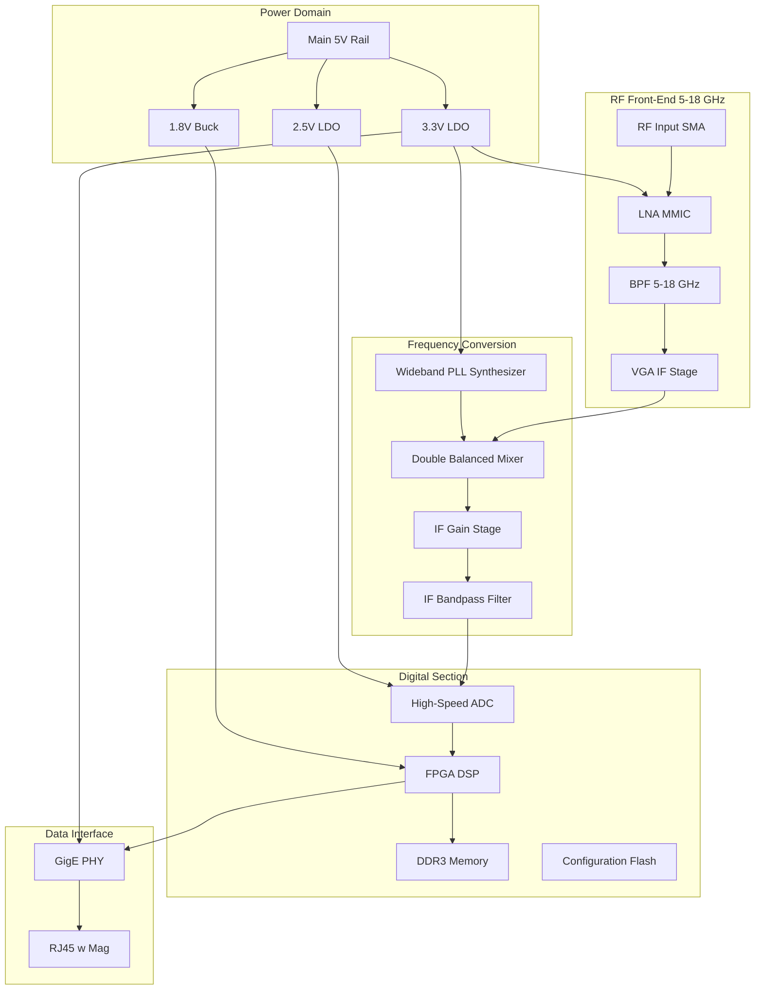

# System Architecture
## mnb

```mermaid
graph TD
    subgraph RF_FRONT_END["RF Front-End 5-18 GHz"]
        RF_IN[RF Input SMA]
        LNA[LNA MMIC]
        BPF[BPF 5-18 GHz]
        VGA[VGA IF Stage]
    end
    
    subgraph CONVERSION["Frequency Conversion"]
        MIXER[Double Balanced Mixer]
        SYNTH[Wideband PLL Synthesizer]
        IF_AMP[IF Gain Stage]
        IF_BPF[IF Bandpass Filter]
    end
    
    subgraph DIGITAL["Digital Section"]
        ADC[High-Speed ADC]
        FPGA[FPGA DSP]
        DDR[DDR3 Memory]
        FLASH[Configuration Flash]
    end
    
    subgraph POWER["Power Domain"]
        MAIN_REG[Main 5V Rail]
        REG_3V3[3.3V LDO]
        REG_1V8[1.8V Buck]
        REG_2V5[2.5V LDO]
    end
    
    subgraph INTERFACE["Data Interface"]
        ETH_PHY[GigE PHY]
        RJ45[RJ45 w Mag]
    end
    
    RF_IN --> LNA
    LNA --> BPF
    BPF --> VGA
    VGA --> MIXER
    SYNTH --> MIXER
    MIXER --> IF_AMP
    IF_AMP --> IF_BPF
    IF_BPF --> ADC
    ADC --> FPGA
    FPGA --> DDR
    FPGA --> ETH_PHY
    ETH_PHY --> RJ45
    
    MAIN_REG --> REG_3V3
    MAIN_REG --> REG_1V8
    MAIN_REG --> REG_2V5
    REG_3V3 --> LNA
    REG_3V3 --> SYNTH
    REG_3V3 --> ETH_PHY
    REG_1V8 --> FPGA
    REG_2V5 --> ADC
    
    class RF signal
    class DIGITAL digital
    class POWER power
```
