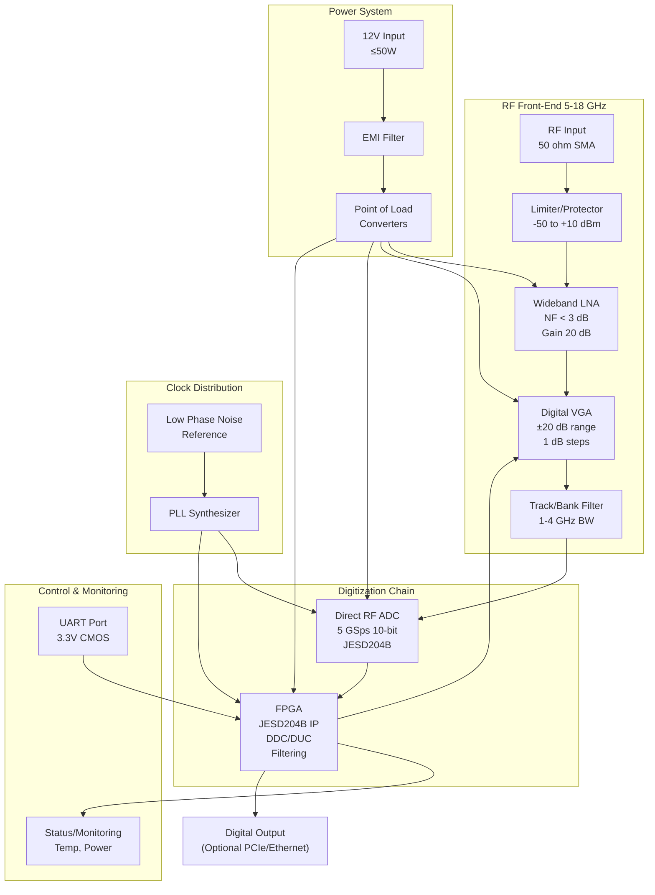

# System Architecture
## uyj

```mermaid
flowchart TD
    subgraph RF_FRONT_END["RF Front-End 5-18 GHz"]
        IN["RF Input<br/>50 ohm SMA"] --> PROT["Limiter/Protector<br/>-50 to +10 dBm"]
        PROT --> LNA["Wideband LNA<br/>NF < 3 dB<br/>Gain 20 dB"]
        LNA --> VGA1["Digital VGA<br/>±20 dB range<br/>1 dB steps"]
        VGA1 --> FILT["Track/Bank Filter<br/>1-4 GHz BW"]
    end
    
    subgraph DIG_CHAIN["Digitization Chain"]
        FILT --> ADC["Direct RF ADC<br/>5 GSps 10-bit<br/>JESD204B"]
        ADC --> FPGA["FPGA<br/>JESD204B IP<br/>DDC/DUC<br/>Filtering"]
    end
    
    subgraph POWER["Power System"]
        PWR["12V Input<br/>≤50W"] --> EMI["EMI Filter"]
        EMI --> POL["Point of Load<br/>Converters"]
    end
    
    subgraph CONTROL["Control & Monitoring"]
        UART["UART Port<br/>3.3V CMOS"] --> FPGA
        FPGA --> VGA1
        FPGA --> STATUS["Status/Monitoring<br/>Temp, Power"]
    end
    
    subgraph CLOCKING["Clock Distribution"]
        OSC["Low Phase Noise<br/>Reference"] --> PLL["PLL Synthesizer"]
        PLL --> ADC
        PLL --> FPGA
    end
    
    POL --> LNA
    POL --> VGA1
    POL --> ADC
    POL --> FPGA
    
    FPGA --> DATA_OUT["Digital Output<br/>(Optional PCIe/Ethernet)"]
    
    class RF_RF input
    class DIG digital
    class PWR power
    class CTRL control
    
    class RF_RF PROT,LNA,VGA1,FILT
    class DIG ADC,FPGA
    class PWR PWR,EMI,POL
    class CTRL UART,STATUS,DATA_OUT
```
