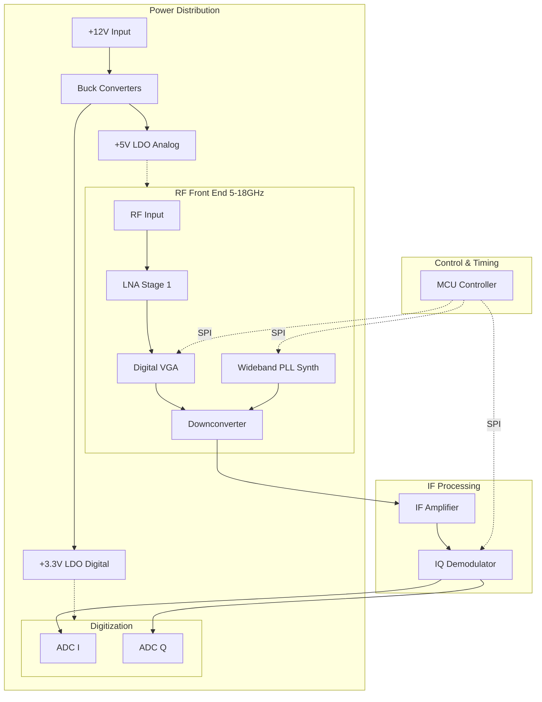

# System Architecture
## ajsfdvhjs

```mermaid
graph TD
    subgraph RF_Front_End["RF Front End 5-18GHz"]
        IN[RF Input] --> LNA1[LNA Stage 1]
        LNA1 --> VGA1[Digital VGA]
        VGA1 --> MIX[Downconverter]
        SYNTH[Wideband PLL Synth] --> MIX
    end
    subgraph IF_Chain["IF Processing"]
        MIX --> IF_AMP[IF Amplifier]
        IF_AMP --> IQ_MOD[IQ Demodulator]
    end
    subgraph Digitization["Digitization"]
        IQ_MOD --> ADC_I[ADC I]
        IQ_MOD --> ADC_Q[ADC Q]
    end
    subgraph Power["Power Distribution"]
        PWR[+12V Input] --> DCDC[Buck Converters]
        DCDC --> LDO1[+5V LDO Analog]
        DCDC --> LDO2[+3.3V LDO Digital]
        LDO1 -.-> RF_Front_End
        LDO2 -.-> Digitization
    end
    subgraph Control["Control & Timing"]
        MCU[MCU Controller] -.->|SPI| VGA1
        MCU -.->|SPI| SYNTH
        MCU -.->|SPI| IQ_MOD
    end
```
