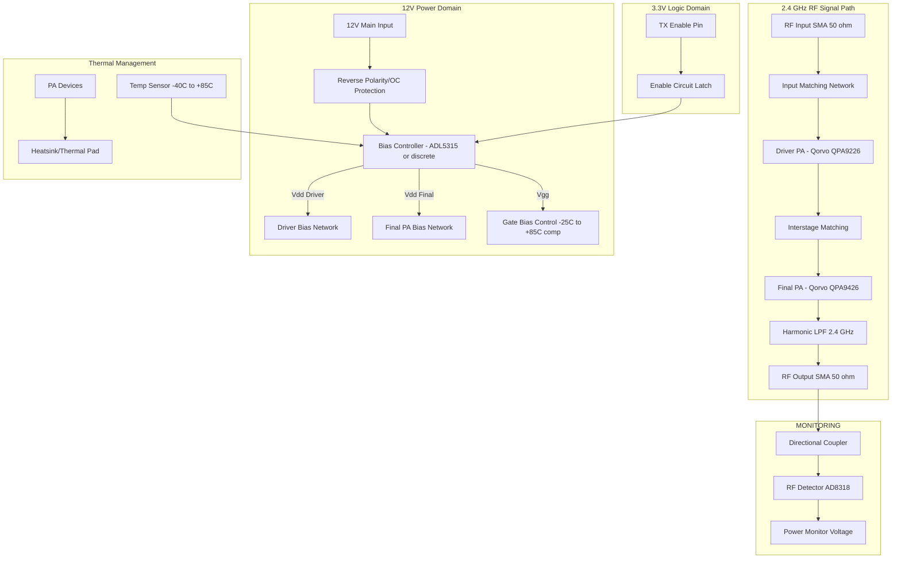

# System Architecture
## rfgg

```mermaid
graph TD
    subgraph RF_PATH[2.4 GHz RF Signal Path]
        RF_IN_RF[RF Input SMA 50 ohm] --> MATCH_IN[Input Matching Network]
        MATCH_IN --> DRIVER[Driver PA - Qorvo QPA9226]
        DRIVER --> INTER_MATCH[Interstage Matching]
        INTER_MATCH --> FINAL[Final PA - Qorvo QPA9426]
        FINAL --> HARMONIC[Harmonic LPF 2.4 GHz]
        HARMONIC --> RF_OUT_RF[RF Output SMA 50 ohm]
    end
    
    subgraph BIAS_CHAIN[12V Power Domain]
        DC_12V[12V Main Input] --> PROTECT[Reverse Polarity/OC Protection]
        PROTECT --> BIAS_CTRL[Bias Controller - ADL5315 or discrete]
        BIAS_CTRL -->|Vdd Driver| DRV_BIAS[Driver Bias Network]
        BIAS_CTRL -->|Vdd Final| FINAL_BIAS[Final PA Bias Network]
        BIAS_CTRL -->|Vgg| GATE_BIAS[Gate Bias Control -25C to +85C comp]
    end
    
    subgraph CONTROL[3.3V Logic Domain]
        TX_EN[TX Enable Pin] --> ENABLE_CIRCUIT[Enable Circuit Latch]
        ENABLE_CIRCUIT --> BIAS_CTRL
    end
    
    subgraph THERMAL[Thermal Management]
        PA_THERM[PA Devices] --> HEATSINK[Heatsink/Thermal Pad]
        TEMP_SENSE[Temp Sensor -40C to +85C] --> BIAS_CTRL
    end
    
    subgraph MONITORING
        COUPLER[Directional Coupler] --> RF_DET[RF Detector AD8318]
        RF_DET --> VOUT_PWR[Power Monitor Voltage]
    end
    
    RF_OUT_RF --> COUPLER
```
