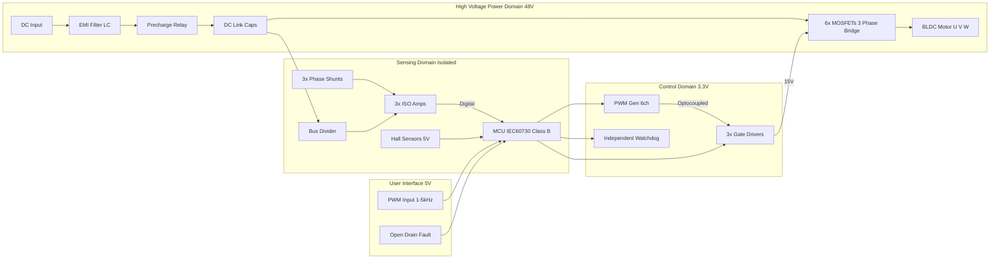

# System Architecture
## fug

```mermaid
graph LR
    subgraph Power_Domain_High["High Voltage Power Domain 48V"]
        DC[DC Input] --> EMI[EMI Filter LC]
        EMI --> PRE[Precharge Relay]
        PRE --> CAP[DC Link Caps]
        CAP --> INVERTER[6x MOSFETs 3 Phase Bridge]
        INVERTER --> MOTOR[BLDC Motor U V W]
    end
    
    subgraph Sensing_Domain["Sensing Domain Isolated"]
        SHUNTS[3x Phase Shunts] --> AMP_ISO[3x ISO Amps]
        VBUS[Bus Divider] --> AMP_ISO
        AMP_ISO -->|Digital| MCU
        HALLS[Hall Sensors 5V] --> MCU
    end
    
    subgraph Control_Domain["Control Domain 3.3V"]
        MCU[MCU IEC60730 Class B] --> PWM[PWM Gen 6ch]
        PWM -->|Optocoupled| GATE[3x Gate Drivers]
        GATE -->|15V| INVERTER
        MCU --> WDT[Independent Watchdog]
    end
    
    subgraph Interface_Domain["User Interface 5V"]
        THROTTLE[PWM Input 1-5kHz] --> MCU
        FAULT[Open Drain Fault] --> MCU
    end
    
    MCU --> GATE
    CAP --> VBUS
```
