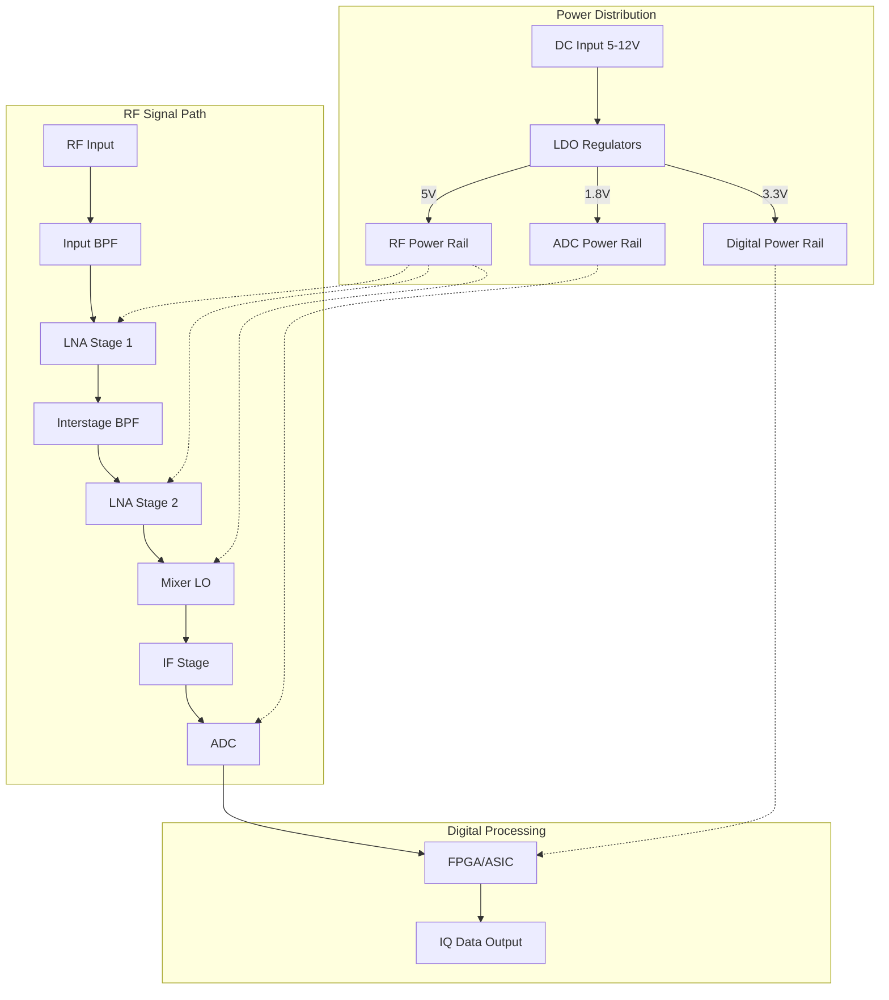

# System Architecture
## sample rf

```mermaid
flowchart TD
    subgraph RF_PATH["RF Signal Path"]
        RF_IN["RF Input"] --> BPF1["Input BPF"]
        BPF1 --> LNA1["LNA Stage 1"]
        LNA1 --> BPF2["Interstage BPF"]
        BPF2 --> LNA2["LNA Stage 2"]
        LNA2 --> MIX["Mixer LO"]
        MIX --> IF_STG["IF Stage"]
        IF_STG --> ADC["ADC"]
    end
    subgraph PWR_DOMAIN["Power Distribution"]
        DC_IN["DC Input 5-12V"] --> VREG["LDO Regulators"]
        VREG -->|5V| RF_PWR["RF Power Rail"]
        VREG -->|3.3V| DIG_PWR["Digital Power Rail"]
        VREG -->|1.8V| ADC_PWR["ADC Power Rail"]
    end
    subgraph DIG_PATH["Digital Processing"]
        ADC --> FPGA["FPGA/ASIC"]
        FPGA --> IQ_OUT["IQ Data Output"]
    end
    RF_PWR -.-> LNA1
    RF_PWR -.-> LNA2
    RF_PWR -.-> MIX
    ADC_PWR -.-> ADC
    DIG_PWR -.-> FPGA
```
