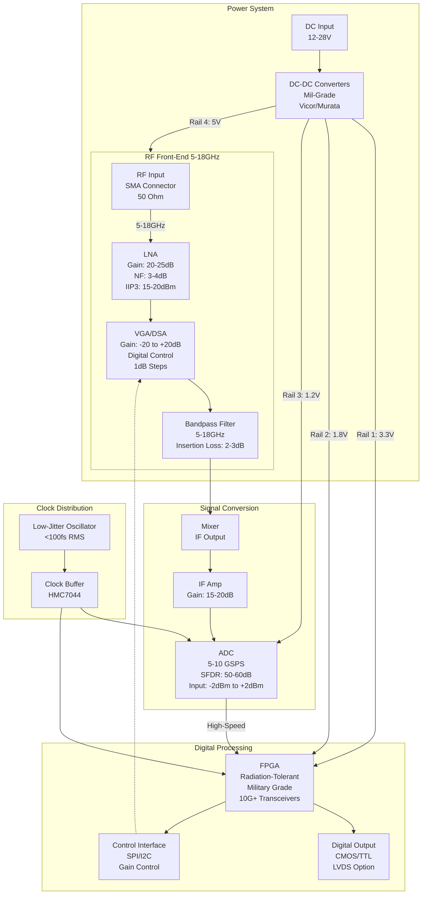

# System Architecture
## Sample Ai Project

```mermaid
flowchart TD
    subgraph RF_Chain["RF Front-End 5-18GHz"]
        RF_IN["RF Input\nSMA Connector\n50 Ohm"] -->|5-18GHz| LNA["LNA\nGain: 20-25dB\nNF: 3-4dB\nIIP3: 15-20dBm"]
        LNA --> VGA["VGA/DSA\nGain: -20 to +20dB\nDigital Control\n1dB Steps"]
        VGA --> FILTER["Bandpass Filter\n5-18GHz\nInsertion Loss: 2-3dB"]
    end
    subgraph Conversion["Signal Conversion"]
        FILTER --> MIX["Mixer\nIF Output"]
        MIX --> IF_AMP["IF Amp\nGain: 15-20dB"]
        IF_AMP --> ADC["ADC\n5-10 GSPS\nSFDR: 50-60dB\nInput: -2dBm to +2dBm"]
    end
    subgraph Digital["Digital Processing"]
        ADC -->|High-Speed| FPGA["FPGA\nRadiation-Tolerant\nMilitary Grade\n10G+ Transceivers"]
        FPGA --> DOUT["Digital Output\nCMOS/TTL\nLVDS Option"]
        FPGA --> CTRL["Control Interface\nSPI/I2C\nGain Control"]
    end
    subgraph Power_Domain["Power System"]
        PWR_IN["DC Input\n12-28V"] --> DC_DC["DC-DC Converters\nMil-Grade\nVicor/Murata"]
        DC_DC -->|Rail 1: 3.3V| FPGA
        DC_DC -->|Rail 2: 1.8V| FPGA
        DC_DC -->|Rail 3: 1.2V| ADC
        DC_DC -->|Rail 4: 5V| RF_Chain
    end
    subgraph Clock_Domain["Clock Distribution"]
        OSC["Low-Jitter Oscillator\n<100fs RMS"] --> CLK_BUF["Clock Buffer\nHMC7044"]
        CLK_BUF --> ADC
        CLK_BUF --> FPGA
    end
    CTRL -.-> VGA
```
