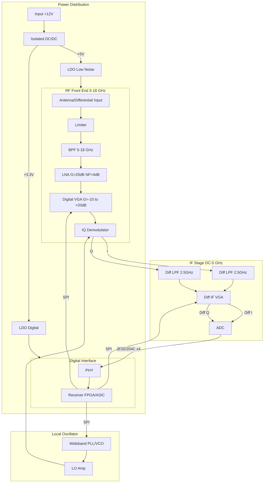

# System Architecture
## khg

```mermaid
flowchart TD
    subgraph RF_CHAIN[RF Front End 5-18 GHz]
        RF_IN[Antenna/Differential Input] --> LIM[Limiter]
        LIM --> BPF[BPF 5-18 GHz]
        BPF --> LNA[LNA G=20dB NF=4dB]
        LNA --> VGA1[Digital VGA G=-10 to +20dB]
        VGA1 --> MIXER[IQ Demodulator]
    end
    
    subgraph LO_PATH[Local Oscillator]
        PLL[Wideband PLL/VCO] --> AMP[LO Amp]
        AMP --> MIXER
    end
    
    subgraph IF_CHAIN[IF Stage DC-5 GHz]
        MIXER -->|I| LPF1[Diff LPF 2.5GHz]
        MIXER -->|Q| LPF2[Diff LPF 2.5GHz]
        LPF1 --> VGA2[Diff IF VGA]
        LPF2 --> VGA2
        VGA2 -->|Diff I| ADC
        VGA2 -->|Diff Q| ADC
    end
    
    subgraph DIGITAL[Digital Interface]
        ADC -->|JESD204C x4| JESD[PHY]
        JESD --> FPGA[Receiver FPGA/ASIC]
        FPGA -->|SPI| VGA1
        FPGA -->|SPI| VGA2
        FPGA -->|SPI| PLL
    end
    
    subgraph POWER[Power Distribution]
        +12V[Input +12V] --> DCDC[Isolated DC/DC]
        DCDC -->|+5V| LDO1[LDO Low Noise]
        DCDC -->|+3.3V| LDO2[LDO Digital]
        LDO1 --> RF_CHAIN
        LDO2 --> DIGITAL
    end
```
