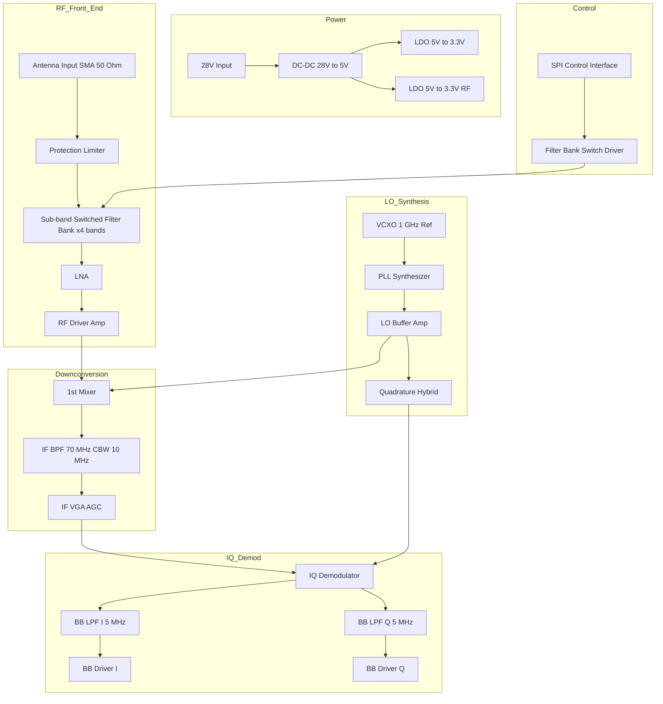

# System Architecture
## hm

```mermaid
flowchart TD
    subgraph RF_Front_End
        A1[Antenna Input SMA 50 Ohm]
        A2[Protection Limiter]
        A3[Sub-band Switched Filter Bank x4 bands]
        A4[LNA]
        A5[RF Driver Amp]
    end
    subgraph LO_Synthesis
        B1[PLL Synthesizer]
        B2[VCXO 1 GHz Ref]
        B3[LO Buffer Amp]
        B4[Quadrature Hybrid]
    end
    subgraph Downconversion
        C1[1st Mixer]
        C2[IF BPF 70 MHz CBW 10 MHz]
        C3[IF VGA AGC]
    end
    subgraph IQ_Demod
        D1[IQ Demodulator]
        D2[BB LPF I 5 MHz]
        D3[BB LPF Q 5 MHz]
        D4[BB Driver I]
        D5[BB Driver Q]
    end
    subgraph Power
        E1[28V Input]
        E2[DC-DC 28V to 5V]
        E3[LDO 5V to 3.3V]
        E4[LDO 5V to 3.3V RF]
    end
    subgraph Control
        F1[SPI Control Interface]
        F2[Filter Bank Switch Driver]
    end
    A1 --> A2 --> A3 --> A4 --> A5 --> C1
    C1 --> C2 --> C3 --> D1
    D1 --> D2 --> D4
    D1 --> D3 --> D5
    B1 --> B3 --> C1
    B3 --> B4 --> D1
    B2 --> B1
    E1 --> E2 --> E3
    E2 --> E4
    F1 --> F2 --> A3
```
