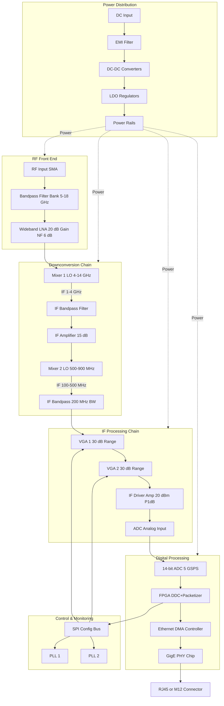

# System Architecture
## kjk

```mermaid
flowchart TD
    subgraph RF_FRONTEND[RF Front End]
        RF_IN[RF Input SMA] --> BAND_SELECT[Bandpass Filter Bank 5-18 GHz]
        BAND_SELECT --> WIDEBAND_LNA[Wideband LNA 20 dB Gain NF 6 dB]
    end
    
    subgraph CONVERSION[Downconversion Chain]
        WIDEBAND_LNA --> MIXER1[Mixer 1 LO 4-14 GHz]
        MIXER1 -->|IF 1-4 GHz| IF_FILTER1[IF Bandpass Filter]
        IF_FILTER1 --> IF_AMP1[IF Amplifier 15 dB]
        IF_AMP1 --> MIXER2[Mixer 2 LO 500-900 MHz]
        MIXER2 -->|IF 100-500 MHz| IF_FILTER2[IF Bandpass 200 MHz BW]
    end
    
    subgraph IF_CHAIN[IF Processing Chain]
        IF_FILTER2 --> VGA1[VGA 1 30 dB Range]
        VGA1 --> VGA2[VGA 2 30 dB Range]
        VGA2 --> DRIVER[IF Driver Amp 20 dBm P1dB]
        DRIVER --> ADC_IN[ADC Analog Input]
    end
    
    subgraph DIGITAL[Digital Processing]
        ADC_IN --> ADC[14-bit ADC 5 GSPS]
        ADC --> FPGA[FPGA DDC+Packetizer]
        FPGA --> DMA[Ethernet DMA Controller]
        DMA --> GIGE_PHY[GigE PHY Chip]
    end
    
    subgraph POWER[Power Distribution]
        PWR_IN[DC Input] --> EMI_FILTER[EMI Filter]
        EMI_FILTER --> DC_DC[DC-DC Converters]
        DC_DC --> LDO[LDO Regulators]
        LDO --> RAILS[Power Rails]
    end
    
    subgraph CONTROL[Control & Monitoring]
        FPGA --> CTRL[SPI Config Bus]
        CTRL --> VGA1
        CTRL --> VGA2
        CTRL --> LO1[PLL 1]
        CTRL --> LO2[PLL 2]
    end
    
    RAILS -.->|Power| RF_FRONTEND
    RAILS -.->|Power| CONVERSION
    RAILS -.->|Power| IF_CHAIN
    RAILS -.->|Power| DIGITAL
    
    GIGE_PHY --> ETH_OUT[RJ45 or M12 Connector]
```
