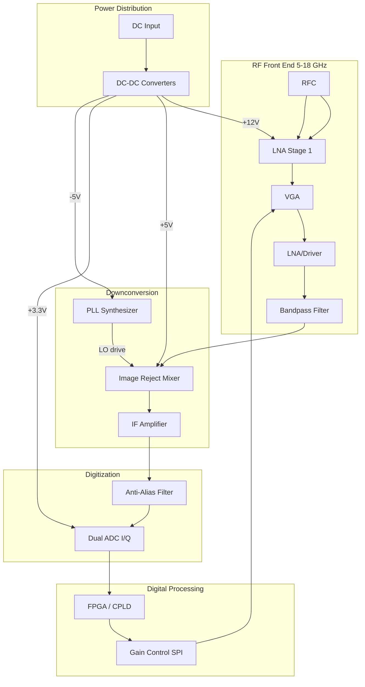

# System Architecture
## receiver

```mermaid
flowchart TD
    subgraph RF_CHAIN["RF Front End 5-18 GHz"]
        IN[RFC] --> LNA1[LNA Stage 1]
        LNA1 --> VGA[VGA]
        VGA --> LNA2[LNA/Driver]
        LNA2 --> BPF[Bandpass Filter]
    end
    
    subgraph CONVERSION["Downconversion"]
        BPF --> MIX[Image Reject Mixer]
        LO[PLL Synthesizer] -->|LO drive| MIX
        MIX --> IF[IF Amplifier]
    end
    
    subgraph DIGITIZER["Digitization"]
        IF --> AAF[Anti-Alias Filter]
        AAF --> ADC[Dual ADC I/Q]
    end
    
    subgraph PROCESSING["Digital Processing"]
        ADC --> FPGA[FPGA / CPLD]
        FPGA --> CTRL[Gain Control SPI]
        CTRL --> VGA
    end
    
    subgraph POWER["Power Distribution"]
        EXT[DC Input] --> REG[DC-DC Converters]
        REG -->|+12V| LNA1
        REG -->|+5V| MIX
        REG -->|+3.3V| ADC
        REG -->|-5V| LO
    end
    IN --> LNA1
```
