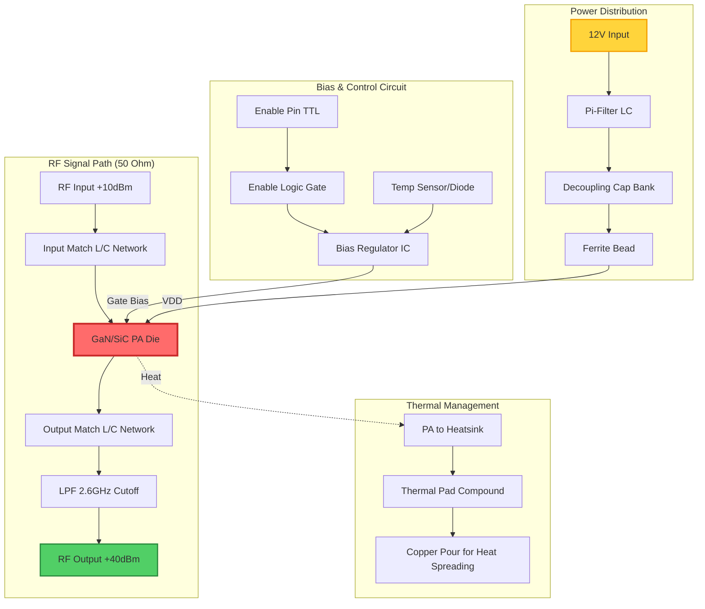

# System Architecture
## tf

```mermaid
graph TD
    subgraph RF_PATH["RF Signal Path (50 Ohm)"]
        RF_IN["RF Input +10dBm"] 
        MATCH_NET["Input Match L/C Network"]
        PA_DEVICE["GaN/SiC PA Die"]
        OUT_MATCH["Output Match L/C Network"]
        HARM_FILTER["LPF 2.6GHz Cutoff"]
        RF_OUT["RF Output +40dBm"]
        
        RF_IN --> MATCH_NET
        MATCH_NET --> PA_DEVICE
        PA_DEVICE --> OUT_MATCH
        OUT_MATCH --> HARM_FILTER
        HARM_FILTER --> RF_OUT
    end
    
    subgraph BIAS_CTRL["Bias & Control Circuit"]
        EN_PIN["Enable Pin TTL"]
        BIAS_REG["Bias Regulator IC"]
        TEMP_SENSE["Temp Sensor/Diode"]
        LOGIC["Enable Logic Gate"]
        
        EN_PIN --> LOGIC
        LOGIC --> BIAS_REG
        TEMP_SENSE --> BIAS_REG
        BIAS_REG -->|Gate Bias| PA_DEVICE
    end
    
    subgraph PWR_DIST["Power Distribution"]
        DC_IN["12V Input"]
        PI_FILTER["Pi-Filter LC"]
        DECOUPLE["Decoupling Cap Bank"]
        FERRITE["Ferrite Bead"]
        
        DC_IN --> PI_FILTER
        PI_FILTER --> DECOUPLE
        DECOUPLE --> FERRITE
        FERRITE -->|VDD| PA_DEVICE
    end
    
    subgraph THERMAL["Thermal Management"]
        PA_HEATSINK["PA to Heatsink"]
        THERMAL_PAD["Thermal Pad Compound"]
        PCB_COPPER["Copper Pour for Heat Spreading"]
        
        PA_DEVICE -.->|Heat| PA_HEATSINK
        PA_HEATSINK --> THERMAL_PAD
        THERMAL_PAD --> PCB_COPPER
    end
    
    style PA_DEVICE fill:#ff6b6b,stroke:#c92a2a,stroke-width:3px
    style RF_OUT fill:#51cf66,stroke:#2b8a3e,stroke-width:2px
    style DC_IN fill:#ffd43b,stroke:#f59f00,stroke-width:2px
```
