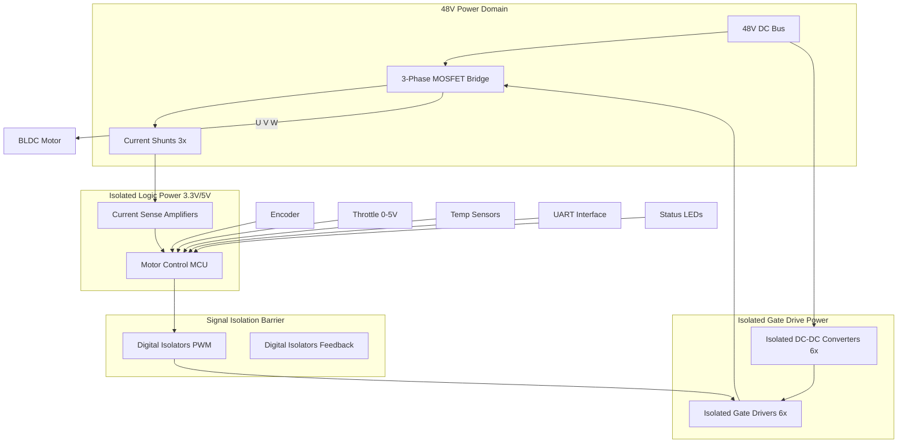

# System Architecture
## rf9

```mermaid
graph TD
    subgraph Power_Domain[48V Power Domain]
        BUS[48V DC Bus]
        INVERTER[3-Phase MOSFET Bridge]
        SHUNT[Current Shunts 3x]
    end
    
    subgraph Logic_Power[Isolated Logic Power 3.3V/5V]
        MCU[Motor Control MCU]
        AMP[Current Sense Amplifiers]
    end
    
    subgraph Gate_Drive_Power[Isolated Gate Drive Power]
        DCDC[Isolated DC-DC Converters 6x]
        DRIVER[Isolated Gate Drivers 6x]
    end
    
    subgraph Signal_Isolation[Signal Isolation Barrier]
        ISO1[Digital Isolators PWM]
        ISO2[Digital Isolators Feedback]
    end
    
    BUS --> INVERTER
    BUS --> DCDC
    INVERTER --> SHUNT
    
    MCU --> ISO1
    ISO1 --> DRIVER
    DCDC --> DRIVER
    DRIVER --> INVERTER
    
    SHUNT --> AMP
    AMP --> MCU
    
    INVERTER -->|U V W| MOTOR_NODE[BLDC Motor]
    
    ENCODER[Encoder] --> MCU
    THROTTLE[Throttle 0-5V] --> MCU
    TEMP[Temp Sensors] --> MCU
    UART[UART Interface] --> MCU
    LED[Status LEDs] --> MCU
```
