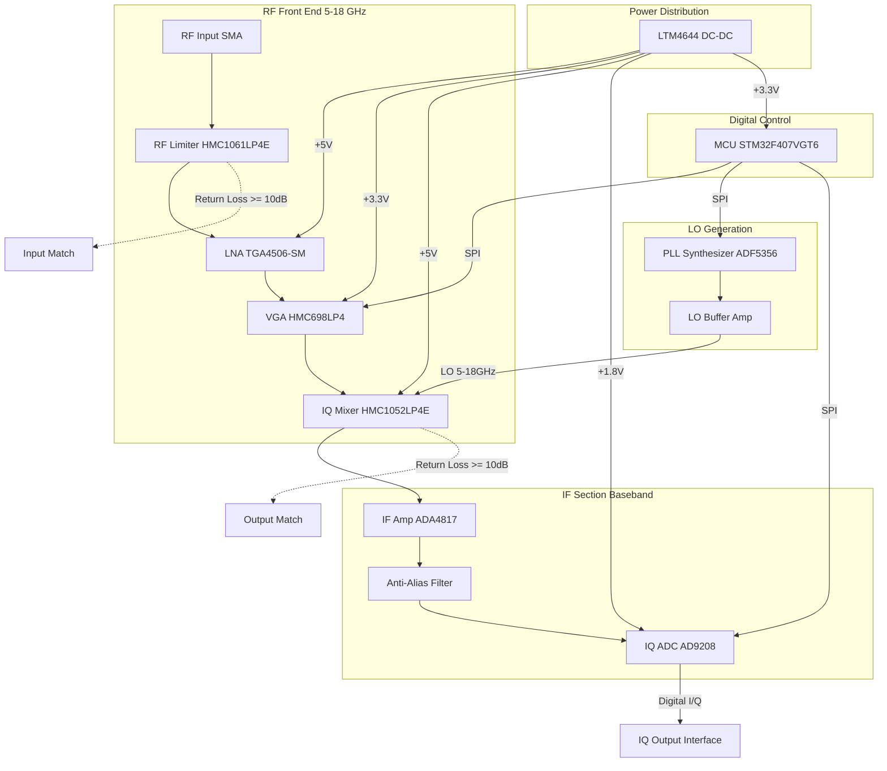

# System Architecture
## receiver

```mermaid
flowchart TD
    subgraph RF_FRONT_END[RF Front End 5-18 GHz]
        RF_IN[RF Input SMA]
        LIM[RF Limiter HMC1061LP4E]
        LNA[LNA TGA4506-SM]
        VGA[VGA HMC698LP4]
        MIX[IQ Mixer HMC1052LP4E]
        
        RF_IN --> LIM
        LIM --> LNA
        LNA --> VGA
        VGA --> MIX
    end
    
    subgraph LO_SECTION[LO Generation]
        LO_SYN[PLL Synthesizer ADF5356]
        LO_AMP[LO Buffer Amp]
        
        LO_SYN --> LO_AMP
    end
    
    subgraph IF_CHAIN[IF Section Baseband]
        IF_AMP[IF Amp ADA4817]
        AAF[Anti-Alias Filter]
        ADC[IQ ADC AD9208]
        
        MIX --> IF_AMP
        IF_AMP --> AAF
        AAF --> ADC
    end
    
    subgraph DIGITAL[Digital Control]
        MCU[MCU STM32F407VGT6]
        
        MCU -->|SPI| VGA
        MCU -->|SPI| LO_SYN
        MCU -->|SPI| ADC
    end
    
    subgraph POWER[Power Distribution]
        DC_DC[LTM4644 DC-DC]
        
        DC_DC -->|+5V| LNA
        DC_DC -->|+3.3V| VGA
        DC_DC -->|+5V| MIX
        DC_DC -->|+1.8V| ADC
        DC_DC -->|+3.3V| MCU
    end
    
    LO_AMP -->|LO 5-18GHz| MIX
    ADC -->|Digital I/Q| IQ_OUT[IQ Output Interface]
    
    LIM -.->|Return Loss >= 10dB| RL_IN[Input Match]
    MIX -.->|Return Loss >= 10dB| RL_OUT[Output Match]
```
