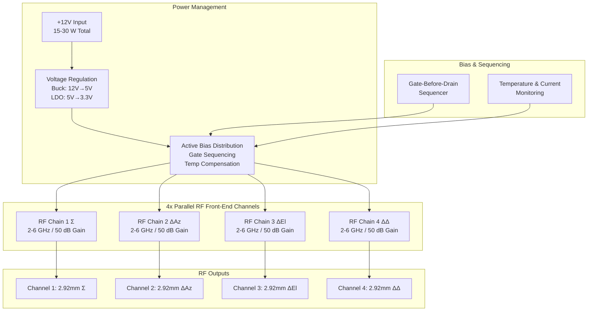

# System Architecture
## hfuf

```mermaid
graph TD
    subgraph RF_Channels["4x Parallel RF Front-End Channels"]
        RF1["RF Chain 1 Σ<br/>2-6 GHz / 50 dB Gain"]
        RF2["RF Chain 2 ΔAz<br/>2-6 GHz / 50 dB Gain"]
        RF3["RF Chain 3 ΔEl<br/>2-6 GHz / 50 dB Gain"]
        RF4["RF Chain 4 ΔΔ<br/>2-6 GHz / 50 dB Gain"]
    end
    
    subgraph Power_Domain["Power Management"]
        PwrIn["+12V Input<br/>15-30 W Total"]
        PwrReg["Voltage Regulation<br/>Buck: 12V→5V<br/>LDO: 5V→3.3V"]
        BiasDist["Active Bias Distribution<br/>Gate Sequencing<br/>Temp Compensation"]
    end
    
    subgraph Control["Bias & Sequencing"]
        Seq["Gate-Before-Drain<br/>Sequencer"]
        Mon["Temperature & Current<br/>Monitoring"]
    end
    
    subgraph Outputs["RF Outputs"]
        Out1["Channel 1: 2.92mm Σ"]
        Out2["Channel 2: 2.92mm ΔAz"]
        Out3["Channel 3: 2.92mm ΔEl"]
        Out4["Channel 4: 2.92mm ΔΔ"]
    end
    
    PwrIn --> PwrReg
    PwrReg --> BiasDist
    BiasDist --> RF1
    BiasDist --> RF2
    BiasDist --> RF3
    BiasDist --> RF4
    
    Seq --> BiasDist
    Mon --> BiasDist
    
    RF1 --> Out1
    RF2 --> Out2
    RF3 --> Out3
    RF4 --> Out4
```
