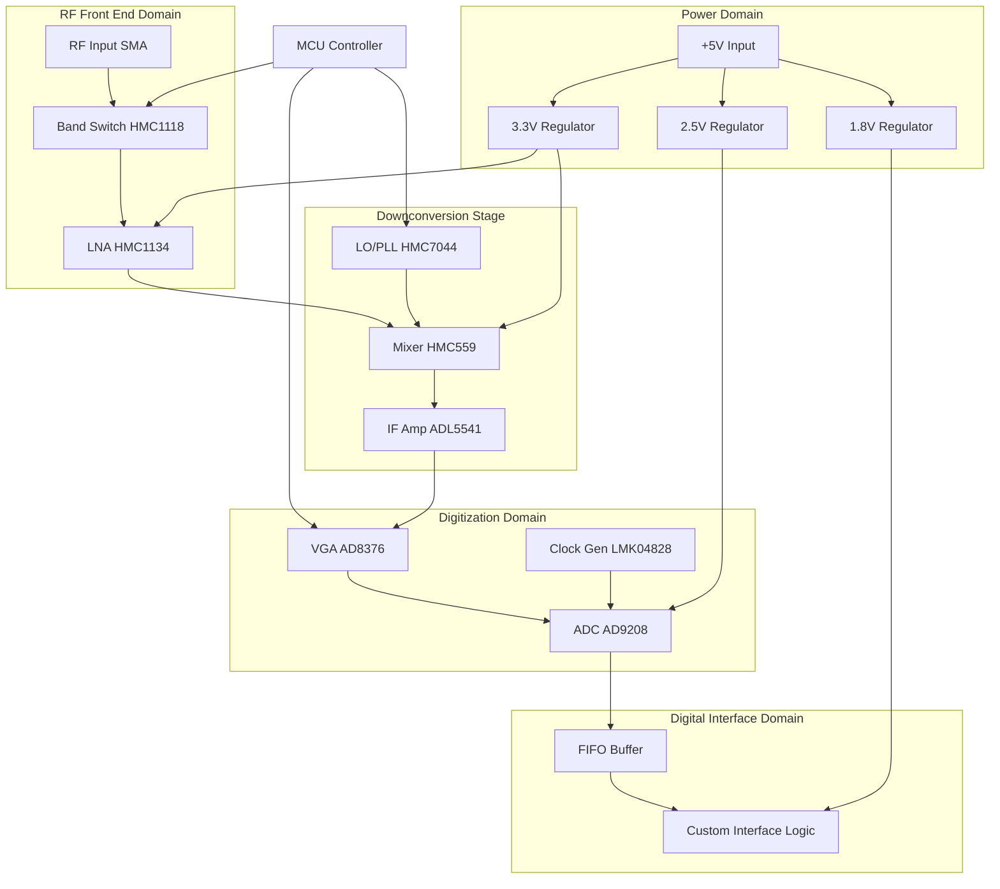

# System Architecture
## sample

```mermaid
graph TD
    subgraph RF_Front_End["RF Front End Domain"]
        RF_IN["RF Input SMA"] --> BAND_SW["Band Switch HMC1118"]
        BAND_SW --> LNA["LNA HMC1134"]
    end
    
    subgraph Downconverter["Downconversion Stage"]
        LNA --> MIXER["Mixer HMC559"]
        LO["LO/PLL HMC7044"] --> MIXER
        MIXER --> IF_AMP["IF Amp ADL5541"]
    end
    
    subgraph Digitizer["Digitization Domain"]
        IF_AMP --> VGA["VGA AD8376"]
        VGA --> ADC["ADC AD9208"]
        CLK["Clock Gen LMK04828"] --> ADC
    end
    
    subgraph Digital_IF["Digital Interface Domain"]
        ADC --> FIFO["FIFO Buffer"]
        FIFO --> CUSTOM_IF["Custom Interface Logic"]
    end
    
    subgraph Power["Power Domain"]
        DC_5V["+5V Input"] --> REG_3V3["3.3V Regulator"]
        DC_5V --> REG_2V5["2.5V Regulator"]
        DC_5V --> REG_1V8["1.8V Regulator"]
        REG_3V3 --> LNA
        REG_3V3 --> MIXER
        REG_2V5 --> ADC
        REG_1V8 --> CUSTOM_IF
    end
    
    MCU_CTRL["MCU Controller"] --> BAND_SW
    MCU_CTRL --> VGA
    MCU_CTRL --> LO
```
