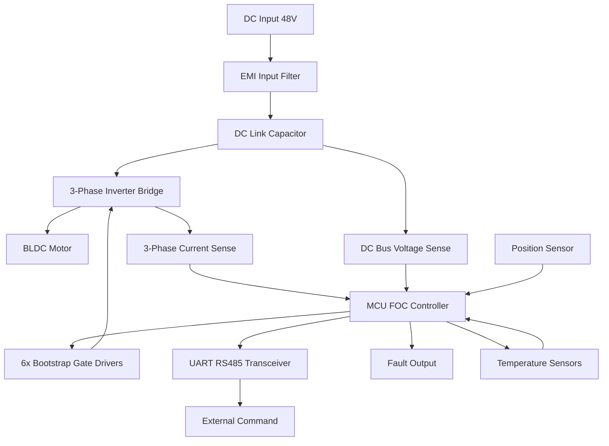

# System Block Diagram
## rf44

```mermaid
graph TD
    DC_IN[DC Input 48V] --> EMI_FILTER[EMI Input Filter]
    EMI_FILTER --> DC_LINK_CAP[DC Link Capacitor]
    DC_LINK_CAP --> INV_BR[3-Phase Inverter Bridge]
    INV_BR --> MOTOR[BLDC Motor]
    INV_BR --> CURRENT_SENSE[3-Phase Current Sense]
    CURRENT_SENSE --> MCU[MCU FOC Controller]
    DC_LINK_CAP --> VOLTAGE_SENSE[DC Bus Voltage Sense]
    VOLTAGE_SENSE --> MCU
    MCU --> PWM_DRV[6x Bootstrap Gate Drivers]
    PWM_DRV --> INV_BR
    POS_SENSOR[Position Sensor] --> MCU
    MCU --> RS485[UART RS485 Transceiver]
    RS485 --> EXT_CMD[External Command]
    MCU --> FAULT[Fault Output]
    MCU --> TEMP_SENSE[Temperature Sensors]
    TEMP_SENSE --> MCU
```
