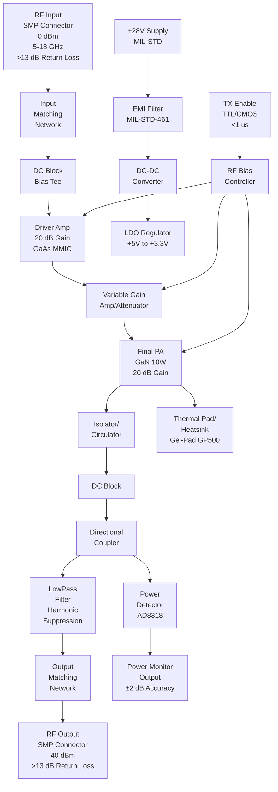

# System Block Diagram
## TX Module

```mermaid
graph TD
    RF_IN[RF Input\nSMP Connector\n0 dBm\n5-18 GHz\n>13 dB Return Loss] --> FL1[Input\nMatching\nNetwork]
    FL1 --> DC1[DC Block\nBias Tee]
    DC1 --> PAD[Driver Amp\n20 dB Gain\nGaAs MMIC]
    PAD --> VGVA[Variable Gain\nAmp/Attenuator]
    VGVA --> AMP[Final PA\nGaN 10W\n20 dB Gain]
    AMP --> ISO[Isolator/
Circulator]
    ISO --> DC2[DC Block]
    DC2 --> CPL1[Directional\nCoupler]
    CPL1 --> FLT[LowPass\nFilter\nHarmonic\nSuppression]
    FLT --> FL2[Output\nMatching\nNetwork]
    FL2 --> RF_OUT[RF Output\nSMP Connector\n40 dBm\n>13 dB Return Loss]
    
    CPL1 --> PWR_DET[Power\nDetector\nAD8318]
    PWR_DET --> MON[Power Monitor\nOutput\n±2 dB Accuracy]
    
    PWR_CTRL[TX Enable\nTTL/CMOS\n<1 us] --> BIAS[RF Bias\nController]
    V_SUPPLY[+28V Supply\nMIL-STD] --> EMI[EMI Filter\nMIL-STD-461]
    EMI --> DC_DC[DC-DC\nConverter]
    DC_DC --> REG[LDO Regulator\n+5V to +3.3V]
    BIAS --> AMP
    BIAS --> PAD
    BIAS --> VGVA
    
    AMP --> HEAT[Thermal Pad/
Heatsink\nGel-Pad GP500]
```
