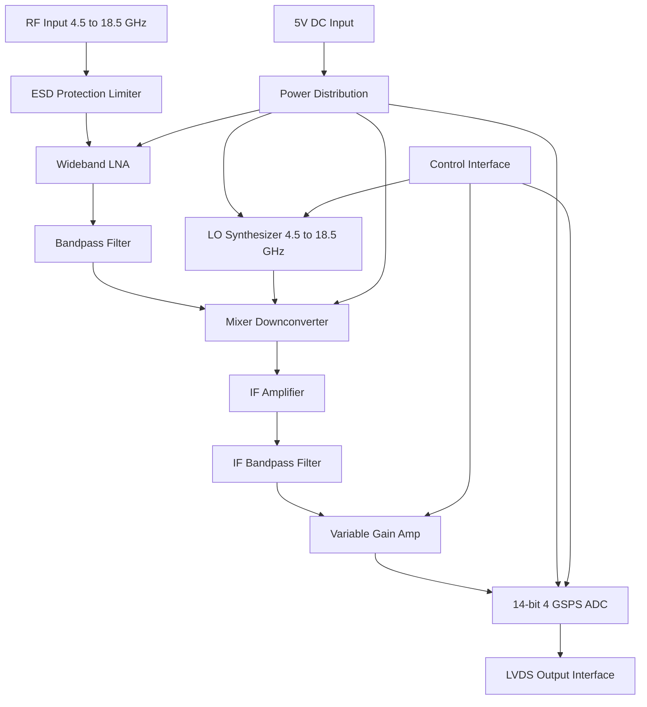

# System Block Diagram
## j,fj

```mermaid
flowchart TD
    RF_IN["RF Input 4.5 to 18.5 GHz"] --> ESD["ESD Protection Limiter"]
    ESD --> LNA["Wideband LNA"]
    LNA --> BPF1["Bandpass Filter"]
    BPF1 --> MIXER["Mixer Downconverter"]
    MIXER --> IF_AMP["IF Amplifier"]
    IF_AMP --> IF_FILTER["IF Bandpass Filter"]
    IF_FILTER --> VGA["Variable Gain Amp"]
    VGA --> ADC["14-bit 4 GSPS ADC"]
    ADC --> LVDS_OUT["LVDS Output Interface"]
    LO_SRC["LO Synthesizer 4.5 to 18.5 GHz"] --> MIXER
    PWR["5V DC Input"] --> PWR_DIST["Power Distribution"]
    PWR_DIST --> LNA
    PWR_DIST --> MIXER
    PWR_DIST --> ADC
    PWR_DIST --> LO_SRC
    CTRL["Control Interface"] --> LO_SRC
    CTRL --> VGA
    CTRL --> ADC
```
