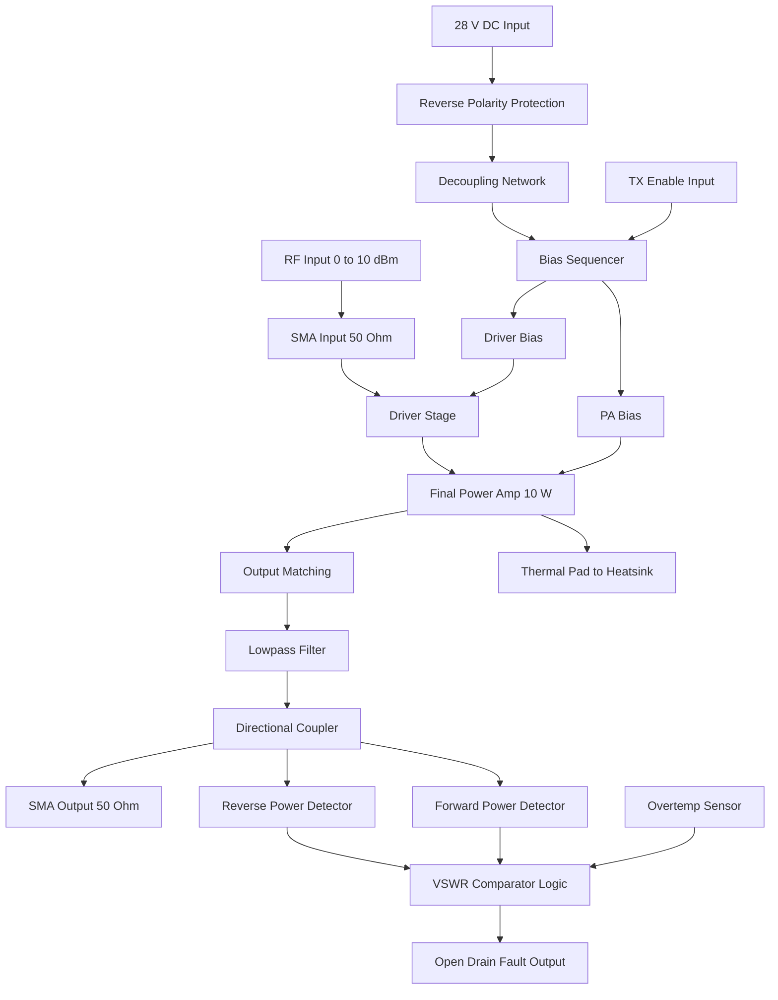

# System Block Diagram
## rf78

```mermaid
graph TD
    RF_IN[RF Input 0 to 10 dBm]
    SMA_IN[SMA Input 50 Ohm]
    DRIVER[Driver Stage]
    PA[Final Power Amp 10 W]
    MATCH_OUT[Output Matching]
    LPF[Lowpass Filter]
    SMA_OUT[SMA Output 50 Ohm]
    DC_IN[28 V DC Input]
    REV_POL[Reverse Polarity Protection]
    BULK[Decoupling Network]
    BIAS_SEQ[Bias Sequencer]
    DRV_BIAS[Driver Bias]
    PA_BIAS[PA Bias]
    CPLR[Directional Coupler]
    FWD_DET[Forward Power Detector]
    REV_DET[Reverse Power Detector]
    VSWR_LOGIC[VSWR Comparator Logic]
    FAULT[Open Drain Fault Output]
    ENABLE[TX Enable Input]
    TEMP[Overtemp Sensor]
    THERM[Thermal Pad to Heatsink]

    RF_IN --> SMA_IN
    SMA_IN --> DRIVER
    DRIVER --> PA
    PA --> MATCH_OUT
    MATCH_OUT --> LPF
    LPF --> CPLR
    CPLR --> SMA_OUT
    DC_IN --> REV_POL
    REV_POL --> BULK
    BULK --> BIAS_SEQ
    BIAS_SEQ --> DRV_BIAS
    DRV_BIAS --> DRIVER
    BIAS_SEQ --> PA_BIAS
    PA_BIAS --> PA
    CPLR --> FWD_DET
    CPLR --> REV_DET
    REV_DET --> VSWR_LOGIC
    FWD_DET --> VSWR_LOGIC
    ENABLE --> BIAS_SEQ
    TEMP --> VSWR_LOGIC
    VSWR_LOGIC --> FAULT
    PA --> THERM
```
