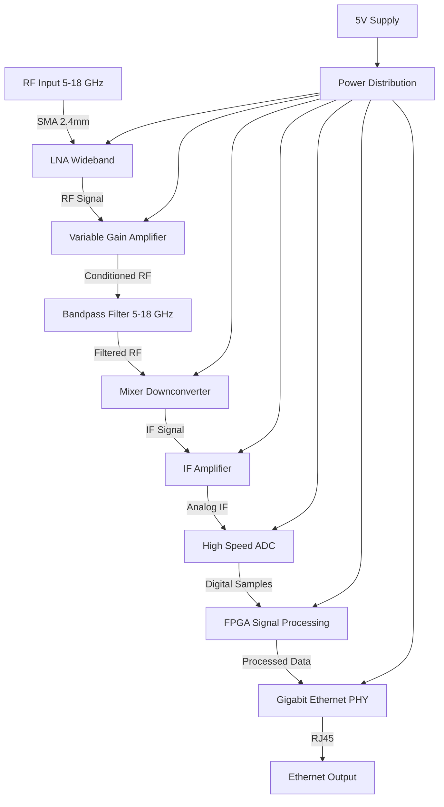

# System Block Diagram
## mn

```mermaid
flowchart TD
    RF_IN[RF Input 5-18 GHz]
    RF_IN -->|SMA 2.4mm| LNA[LNA Wideband]
    LNA -->|RF Signal| VGA[Variable Gain Amplifier]
    VGA -->|Conditioned RF| BPF[Bandpass Filter 5-18 GHz]
    BPF -->|Filtered RF| MIXER[Mixer Downconverter]
    MIXER -->|IF Signal| IF_AMP[IF Amplifier]
    IF_AMP -->|Analog IF| ADC[High Speed ADC]
    ADC -->|Digital Samples| FPGA[FPGA Signal Processing]
    FPGA -->|Processed Data| GIGE_PHY[Gigabit Ethernet PHY]
    GIGE_PHY -->|RJ45| ETH_OUT[Ethernet Output]
    PWR[5V Supply] --> PWR_DIST[Power Distribution]
    PWR_DIST --> LNA
    PWR_DIST --> VGA
    PWR_DIST --> MIXER
    PWR_DIST --> IF_AMP
    PWR_DIST --> ADC
    PWR_DIST --> FPGA
    PWR_DIST --> GIGE_PHY
```
