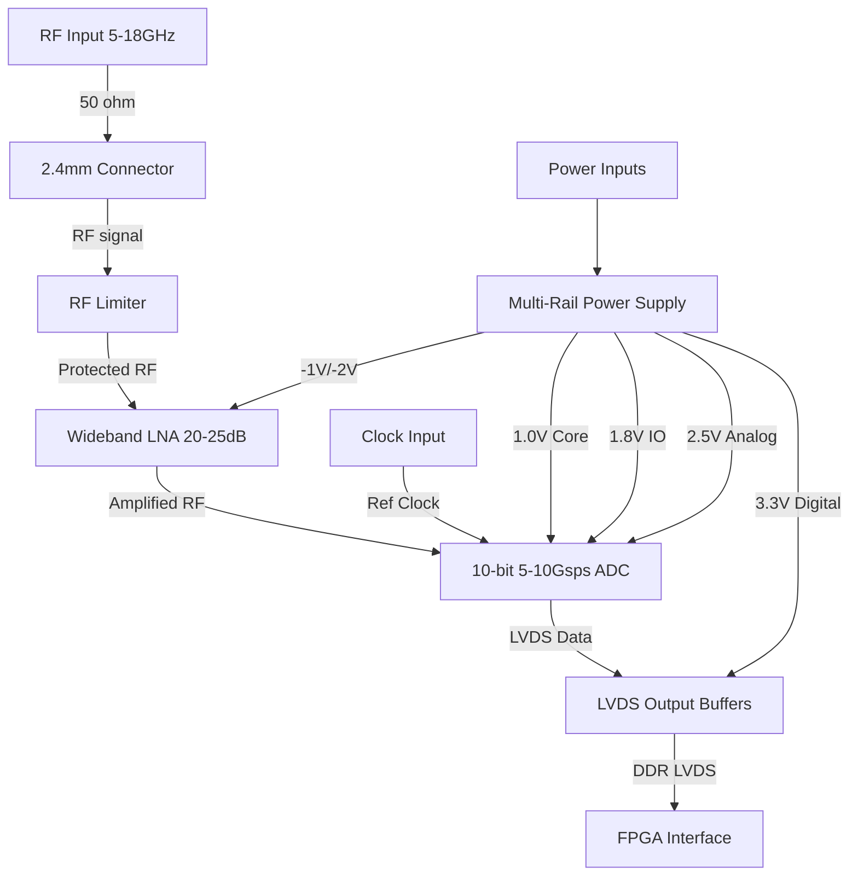

# System Block Diagram
## hjgjf

```mermaid
flowchart TD
    RF_IN["RF Input 5-18GHz"] -->|50 ohm| J1["2.4mm Connector"]
    J1 -->|RF signal| LIM["RF Limiter"]
    LIM -->|Protected RF| LNA["Wideband LNA 20-25dB"]
    LNA -->|Amplified RF| ADC["10-bit 5-10Gsps ADC"]
    CLK_IN["Clock Input"] -->|Ref Clock| ADC
    ADC -->|LVDS Data| LVDS["LVDS Output Buffers"]
    LVDS -->|DDR LVDS| FPGA["FPGA Interface"]
    PWR_IN["Power Inputs"] --> PWR["Multi-Rail Power Supply"]
    PWR -->|1.0V Core| ADC
    PWR -->|1.8V IO| ADC
    PWR -->|2.5V Analog| ADC
    PWR -->|3.3V Digital| LVDS
    PWR -->|-1V/-2V| LNA
```
