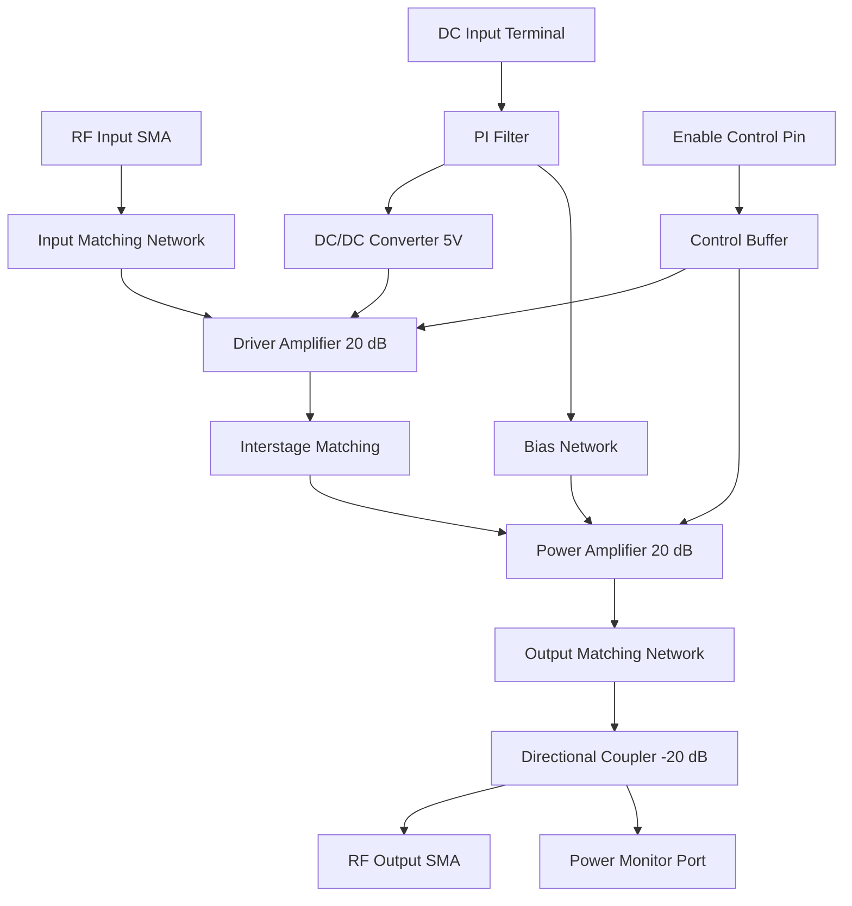

# System Block Diagram
## rf4

```mermaid
graph TD
    RF_IN[RF Input SMA] --> IN_MATCH[Input Matching Network]
    IN_MATCH --> DRIVER[Driver Amplifier 20 dB]
    DRIVER --> INTER_MATCH[Interstage Matching]
    INTER_MATCH --> PA[Power Amplifier 20 dB]
    PA --> OUT_MATCH[Output Matching Network]
    OUT_MATCH --> COUPLER[Directional Coupler -20 dB]
    COUPLER --> RF_OUT[RF Output SMA]
    COUPLER --> PWR_MON[Power Monitor Port]
    
    DC_IN[DC Input Terminal] --> PI_FILTER[PI Filter]
    PI_FILTER --> DC_DC[DC/DC Converter 5V]
    PI_FILTER --> BIAS[Bias Network]
    DC_DC --> DRIVER
    BIAS --> PA
    
    CTRL[Enable Control Pin] --> CTRL_BUF[Control Buffer]
    CTRL_BUF --> DRIVER
    CTRL_BUF --> PA
```
