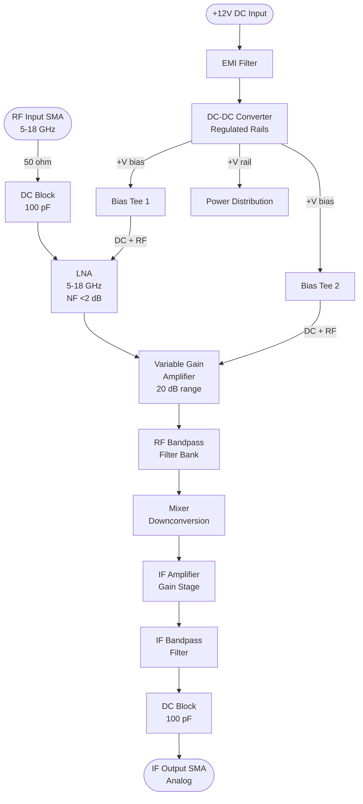

# System Block Diagram
## Receiver Module

```mermaid
flowchart TD
    RF_IN([RF Input SMA<br/>5-18 GHz]) -->|50 ohm| DC_BLOCK1[DC Block<br/>100 pF]
    DC_BLOCK1 --> LNA[LNA<br/>5-18 GHz<br/>NF <2 dB]
    LNA --> VGA[Variable Gain<br/>Amplifier<br/>20 dB range]
    VGA --> RF_FILTER[RF Bandpass<br/>Filter Bank]
    RF_FILTER --> MIXER[Mixer<br/>Downconversion]
    MIXER --> IF_AMP[IF Amplifier<br/>Gain Stage]
    IF_AMP --> IF_FILTER[IF Bandpass<br/>Filter]
    IF_FILTER --> DC_BLOCK2[DC Block<br/>100 pF]
    DC_BLOCK2 --> IF_OUT([IF Output SMA<br/>Analog])
    
    PWR_IN([+12V DC Input]) --> EMI_FILTER[EMI Filter]
    EMI_FILTER --> DC_DC[DC-DC Converter<br/>Regulated Rails]
    DC_DC -->|+V bias| BIAS_T1[Bias Tee 1]
    DC_DC -->|+V bias| BIAS_T2[Bias Tee 2]
    DC_DC -->|+V rail| PWR_DISTRIBUTION[Power Distribution]
    
    BIAS_T1 -->|DC + RF| LNA
    BIAS_T2 -->|DC + RF| VGA
```
