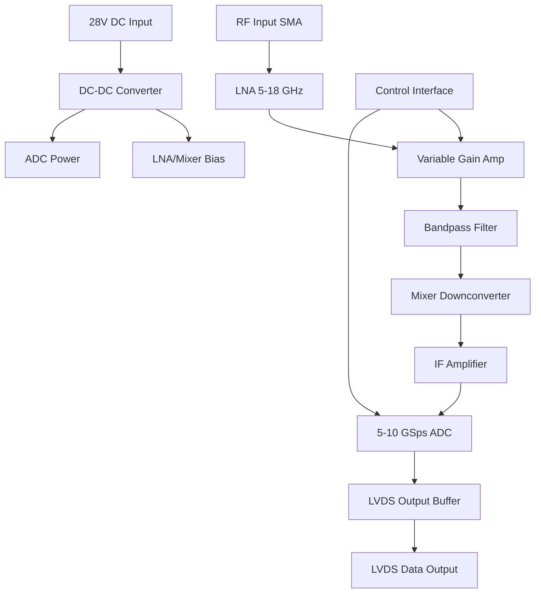

# System Block Diagram
## ehg

```mermaid
flowchart TD
    RF_IN[RF Input SMA] --> LNA[LNA 5-18 GHz]
    LNA --> VGA[Variable Gain Amp]
    VGA --> BPF[Bandpass Filter]
    BPF --> MIXER[Mixer Downconverter]
    MIXER --> IF_AMP[IF Amplifier]
    IF_AMP --> ADC[5-10 GSps ADC]
    ADC --> LVDS[LVDS Output Buffer]
    LVDS --> DATA_OUT[LVDS Data Output]
    PWR[28V DC Input] --> DC_DC[DC-DC Converter]
    DC_DC --> BIAS[LNA/Mixer Bias]
    DC_DC --> ADC_PWR[ADC Power]
    CTRL[Control Interface] --> VGA
    CTRL --> ADC
```
