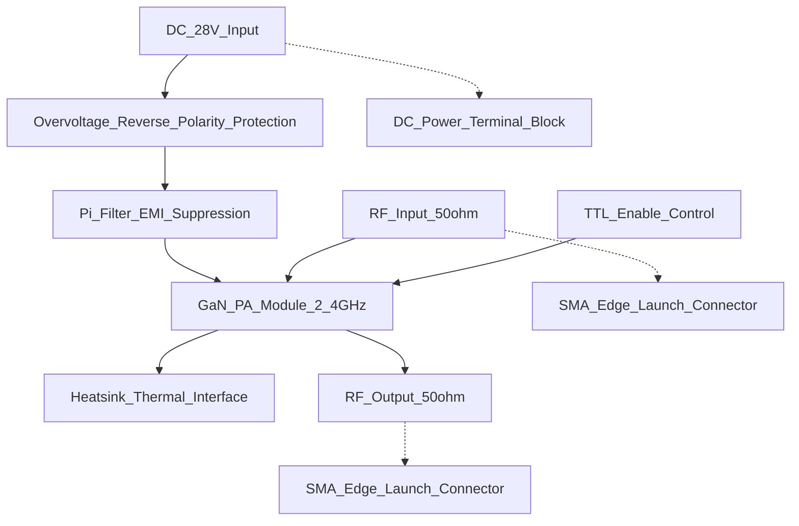

# System Block Diagram
## rfff

```mermaid
graph TD
    DC_INPUT[DC_28V_Input] --> DC_PROT[Overvoltage_Reverse_Polarity_Protection]
    DC_PROT --> DC_FILTER[Pi_Filter_EMI_Suppression]
    DC_FILTER --> PA_MODULE[GaN_PA_Module_2_4GHz]
    PA_MODULE --> HEATSINK[Heatsink_Thermal_Interface]
    
    RF_IN[RF_Input_50ohm] --> PA_MODULE
    PA_MODULE --> RF_OUT[RF_Output_50ohm]
    
    CTRL[TTL_Enable_Control] --> PA_MODULE
    
    RF_IN -.-> RF_IN_PORT[SMA_Edge_Launch_Connector]
    RF_OUT -.-> RF_OUT_PORT[SMA_Edge_Launch_Connector]
    DC_INPUT -.-> DC_TERM[DC_Power_Terminal_Block]
```
