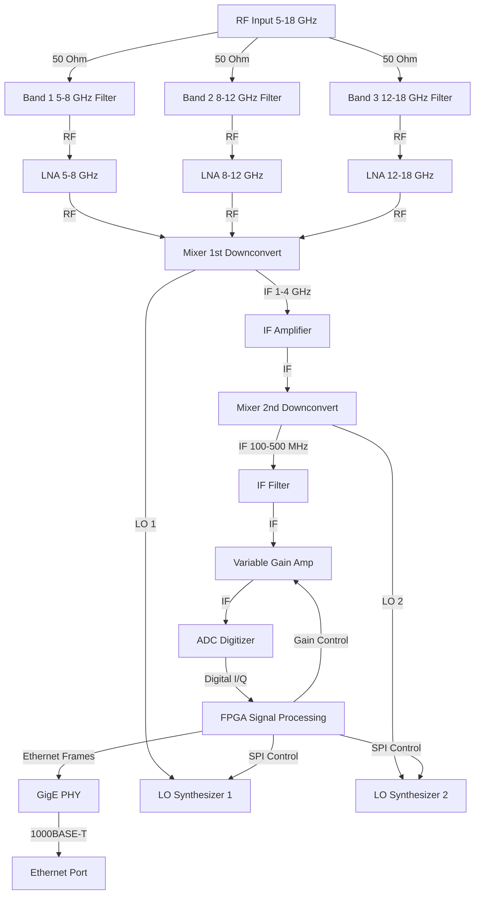

# System Block Diagram
## kjk

```mermaid
flowchart TD
    RF_IN[RF Input 5-18 GHz] -->|50 Ohm| BAND1[Band 1 5-8 GHz Filter]
    RF_IN -->|50 Ohm| BAND2[Band 2 8-12 GHz Filter]
    RF_IN -->|50 Ohm| BAND3[Band 3 12-18 GHz Filter]
    BAND1 -->|RF| LNA1[LNA 5-8 GHz]
    BAND2 -->|RF| LNA2[LNA 8-12 GHz]
    BAND3 -->|RF| LNA3[LNA 12-18 GHz]
    LNA1 -->|RF| MIXER1[Mixer 1st Downconvert]
    LNA2 -->|RF| MIXER1
    LNA3 -->|RF| MIXER1
    MIXER1 -->|IF 1-4 GHz| IF_AMP1[IF Amplifier]
    IF_AMP1 -->|IF| MIXER2[Mixer 2nd Downconvert]
    MIXER2 -->|IF 100-500 MHz| IF_FILTER[IF Filter]
    IF_FILTER -->|IF| VGA[Variable Gain Amp]
    VGA -->|IF| ADC[ADC Digitizer]
    ADC -->|Digital I/Q| FPGA[FPGA Signal Processing]
    FPGA -->|Ethernet Frames| GIGE[GigE PHY]
    GIGE -->|1000BASE-T| ETH_OUT[Ethernet Port]
    MIXER1 -->|LO 1| LO1[LO Synthesizer 1]
    MIXER2 -->|LO 2| LO2[LO Synthesizer 2]
    FPGA -->|SPI Control| LO1
    FPGA -->|SPI Control| LO2
    FPGA -->|Gain Control| VGA
```
