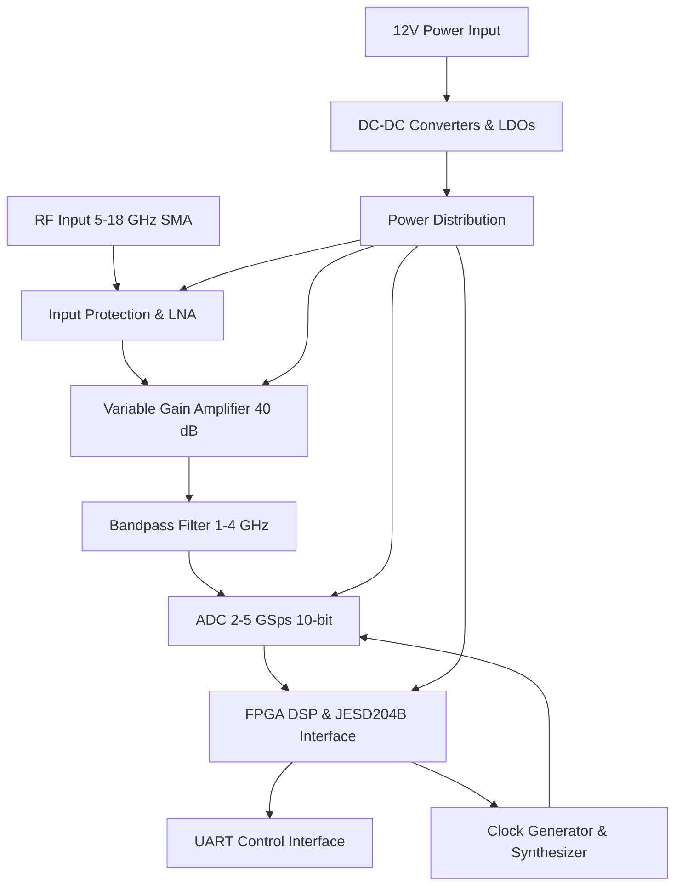

# System Block Diagram
## uyj

```mermaid
flowchart TD
    RF_IN["RF Input 5-18 GHz SMA"] --> LNA_PROT["Input Protection & LNA"]
    LNA_PROT --> VGA["Variable Gain Amplifier 40 dB"]
    VGA --> BPF["Bandpass Filter 1-4 GHz"]
    BPF --> ADC["ADC 2-5 GSps 10-bit"]
    ADC --> FPGA["FPGA DSP & JESD204B Interface"]
    FPGA --> UART["UART Control Interface"]
    FPGA --> CLK["Clock Generator & Synthesizer"]
    CLK --> ADC
    PWR["12V Power Input"] --> DCDC["DC-DC Converters & LDOs"]
    DCDC --> PWR_DIST["Power Distribution"]
    PWR_DIST --> LNA_PROT
    PWR_DIST --> VGA
    PWR_DIST --> ADC
    PWR_DIST --> FPGA
```
