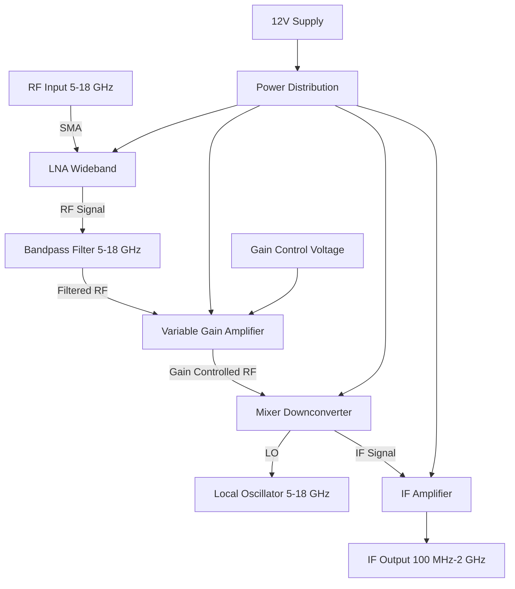

# System Block Diagram
## jhf

```mermaid
flowchart TD
    RF_IN[RF Input 5-18 GHz] -->|SMA| LNA[LNA Wideband]
    LNA -->|RF Signal| BPF[Bandpass Filter 5-18 GHz]
    BPF -->|Filtered RF| VGA[Variable Gain Amplifier]
    VGA -->|Gain Controlled RF| MIXER[Mixer Downconverter]
    MIXER -->|LO| LO[Local Oscillator 5-18 GHz]
    MIXER -->|IF Signal| IF_AMP[IF Amplifier]
    IF_AMP --> IF_OUT[IF Output 100 MHz-2 GHz]
    PWR[12V Supply] --> PWR_DIST[Power Distribution]
    PWR_DIST --> LNA
    PWR_DIST --> VGA
    PWR_DIST --> MIXER
    PWR_DIST --> IF_AMP
    CTRL[Gain Control Voltage] --> VGA
```
