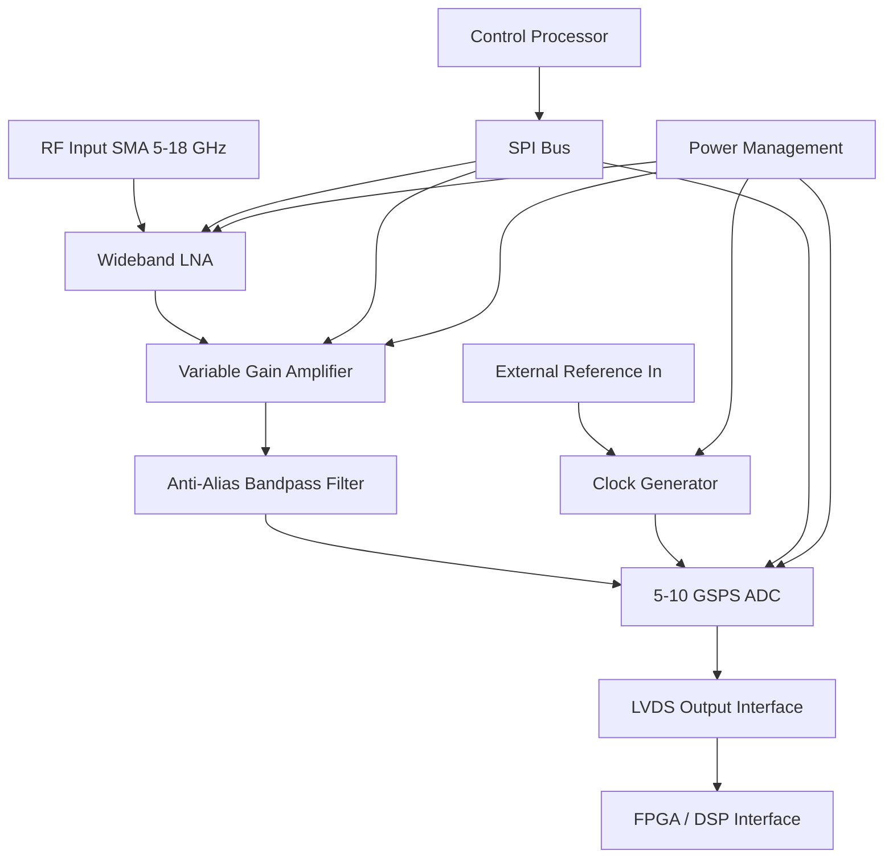

# System Block Diagram
## hgyu

```mermaid
flowchart TD
    RF_IN["RF Input SMA 5-18 GHz"] --> LNA["Wideband LNA"]
    LNA --> VGA["Variable Gain Amplifier"]
    VGA --> FILTER["Anti-Alias Bandpass Filter"]
    FILTER --> ADC["5-10 GSPS ADC"]
    ADC --> LVDS["LVDS Output Interface"]
    LVDS --> FPGA["FPGA / DSP Interface"]
    
    CLK_SRC["Clock Generator"] --> ADC
    EXT_REF["External Reference In"] --> CLK_SRC
    
    CTRL["Control Processor"] --> SPI["SPI Bus"]
    SPI --> LNA
    SPI --> VGA
    SPI --> ADC
    
    PWR["Power Management"] --> LNA
    PWR --> VGA
    PWR --> ADC
    PWR --> CLK_SRC
```
