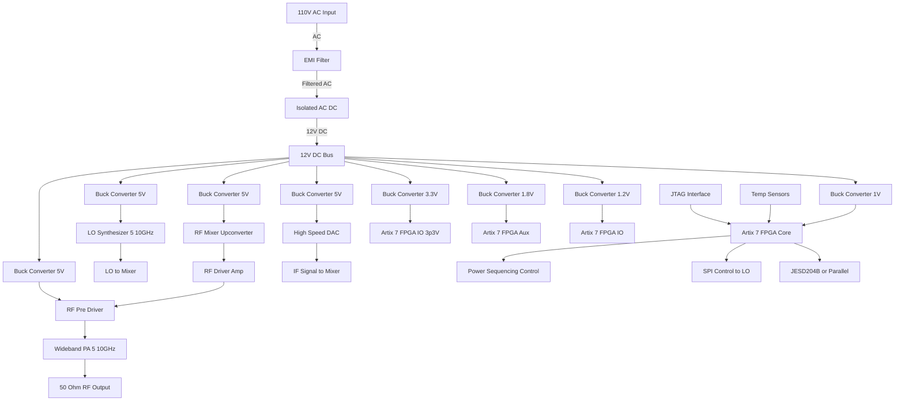

# System Block Diagram
## rffff

```mermaid
graph TD
    AC110[110V AC Input] -->|AC| EMI_Filter[EMI Filter]
    EMI_Filter -->|Filtered AC| AC_DC[Isolated AC DC]
    AC_DC -->|12V DC| DC_Bus[12V DC Bus]
    DC_Bus --> Buck1[Buck Converter 1V]
    DC_Bus --> Buck2[Buck Converter 1.2V]
    DC_Bus --> Buck3[Buck Converter 1.8V]
    DC_Bus --> Buck4[Buck Converter 3.3V]
    DC_Bus --> Buck5[Buck Converter 5V]
    DC_Bus --> Buck6[Buck Converter 5V]
    DC_Bus --> Buck7[Buck Converter 5V]
    DC_Bus --> Buck8[Buck Converter 5V]
    Buck1 --> FPGA_Core[Artix 7 FPGA Core]
    Buck2 --> FPGA_IO[Artix 7 FPGA IO]
    Buck3 --> FPGA_Aux[Artix 7 FPGA Aux]
    Buck4 --> FPGA_IO_3p3[Artix 7 FPGA IO 3p3V]
    Buck5 --> DAC[High Speed DAC]
    Buck6 --> Mixer[RF Mixer Upconverter]
    Buck7 --> LO_Synth[LO Synthesizer 5 10GHz]
    Buck8 --> RF_Prep[RF Pre Driver]
    FPGA_Core --> JESD[JESD204B or Parallel]
    FPGA_Core --> LO_Control[SPI Control to LO]
    DAC --> IF_Signal[IF Signal to Mixer]
    LO_Synth --> LO_LO[LO to Mixer]
    Mixer --> RF_Driver[RF Driver Amp]
    RF_Driver --> RF_Prep
    RF_Prep --> Main_Pa[Wideband PA 5 10GHz]
    Main_Pa --> RF_Out[50 Ohm RF Output]
    JTAG[JTAG Interface] --> FPGA_Core
    Temp_Mon[Temp Sensors] --> FPGA_Core
    FPGA_Core --> Pwr_Seq[Power Sequencing Control]
```
