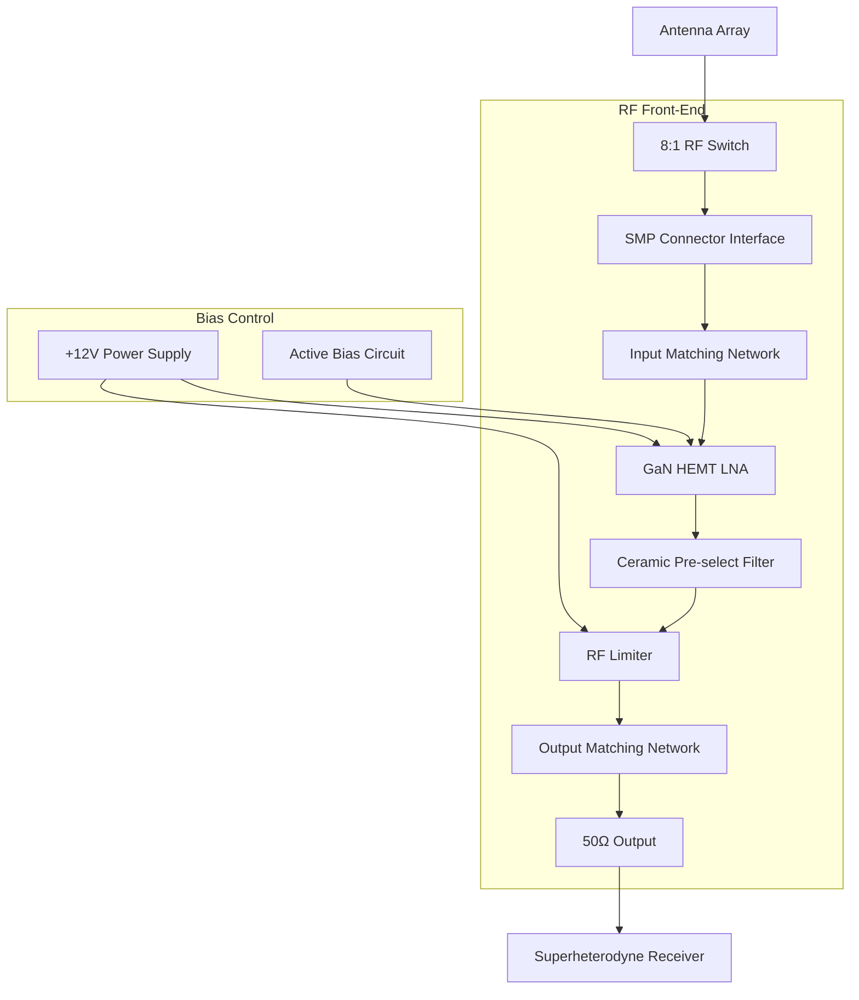

# System Block Diagram
## gvng

```mermaid
flowchart TD
    A[Antenna Array] --> B[8:1 RF Switch]
    B --> C[SMP Connector Interface]
    C --> D[Input Matching Network]
    D --> E[GaN HEMT LNA]
    E --> F[Ceramic Pre-select Filter]
    F --> G[RF Limiter]
    G --> H[Output Matching Network]
    H --> I[50Ω Output]
    I --> J[Superheterodyne Receiver]
    
    subgraph RF Front-End
        B
        C
        D
        E
        F
        G
        H
        I
    end
    
    subgraph Bias Control
        K[+12V Power Supply] --> E
        K --> G
        L[Active Bias Circuit] --> E
    end
```
