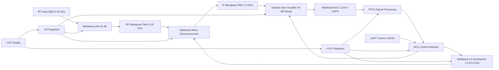

# System Block Diagram
## rf tx

```mermaid
graph LR
    RF_IN[RF Input SMA 5-18 GHz] --> LNA[Wideband LNA 20 dB]
    LNA --> BPF[RF Bandpass Filter 5-18 GHz]
    BPF --> MIXER[Wideband Mixer Downconversion]
    LO[Wideband LO Synthesizer 7.4-20.4 GHz] --> MIXER
    MIXER --> IF_BPF[IF Bandpass Filter 2.4 GHz]
    IF_BPF --> VGA[Variable Gain Amplifier 40 dB Range]
    VGA --> ADC[Wideband ADC 12-bit 4 GSPS]
    ADC --> FPGA[FPGA Signal Processing]
    FPGA --> MCU[MCU Control Interface]
    MCU --> LO
    MCU --> VGA
    UART[UART Control 115200] --> MCU
    PWR[+12V Supply] --> REG1[+5V Regulator]
    PWR --> REG2[+3.3V Regulator]
    REG1 --> LNA
    REG1 --> MIXER
    REG1 --> VGA
    REG2 --> LO
    REG2 --> MCU
    REG2 --> FPGA
```
