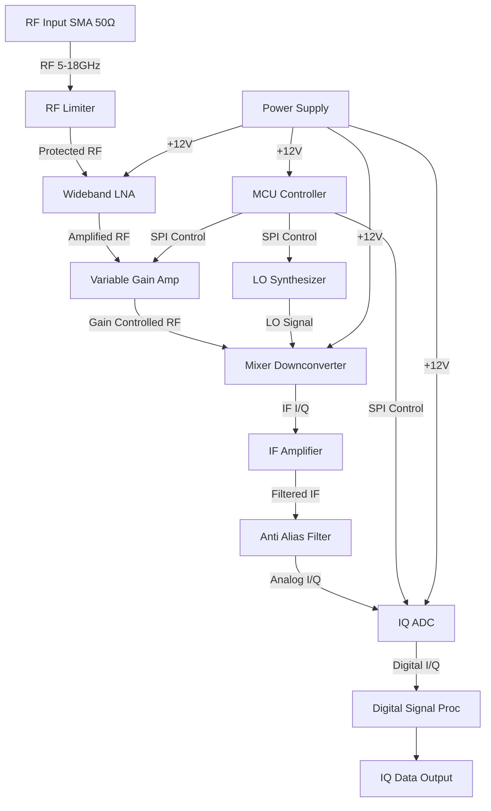

# System Block Diagram
## receiver

```mermaid
flowchart TD
    RF_IN[RF Input SMA 50Ω]
    LIM[RF Limiter]
    LNA[Wideband LNA]
    VGA[Variable Gain Amp]
    MIX[Mixer Downconverter]
    LO[LO Synthesizer]
    IF_AMP[IF Amplifier]
    AF[Anti Alias Filter]
    ADC[IQ ADC]
    FPGA[Digital Signal Proc]
    CTRL[MCU Controller]
    PWR[Power Supply]
    IQ_OUT[IQ Data Output]
    
    RF_IN -->|RF 5-18GHz| LIM
    LIM -->|Protected RF| LNA
    LNA -->|Amplified RF| VGA
    VGA -->|Gain Controlled RF| MIX
    LO -->|LO Signal| MIX
    MIX -->|IF I/Q| IF_AMP
    IF_AMP -->|Filtered IF| AF
    AF -->|Analog I/Q| ADC
    ADC -->|Digital I/Q| FPGA
    FPGA --> IQ_OUT
    CTRL -->|SPI Control| VGA
    CTRL -->|SPI Control| LO
    CTRL -->|SPI Control| ADC
    PWR -->|+12V| LNA
    PWR -->|+12V| MIX
    PWR -->|+12V| ADC
    PWR -->|+12V| CTRL
```
