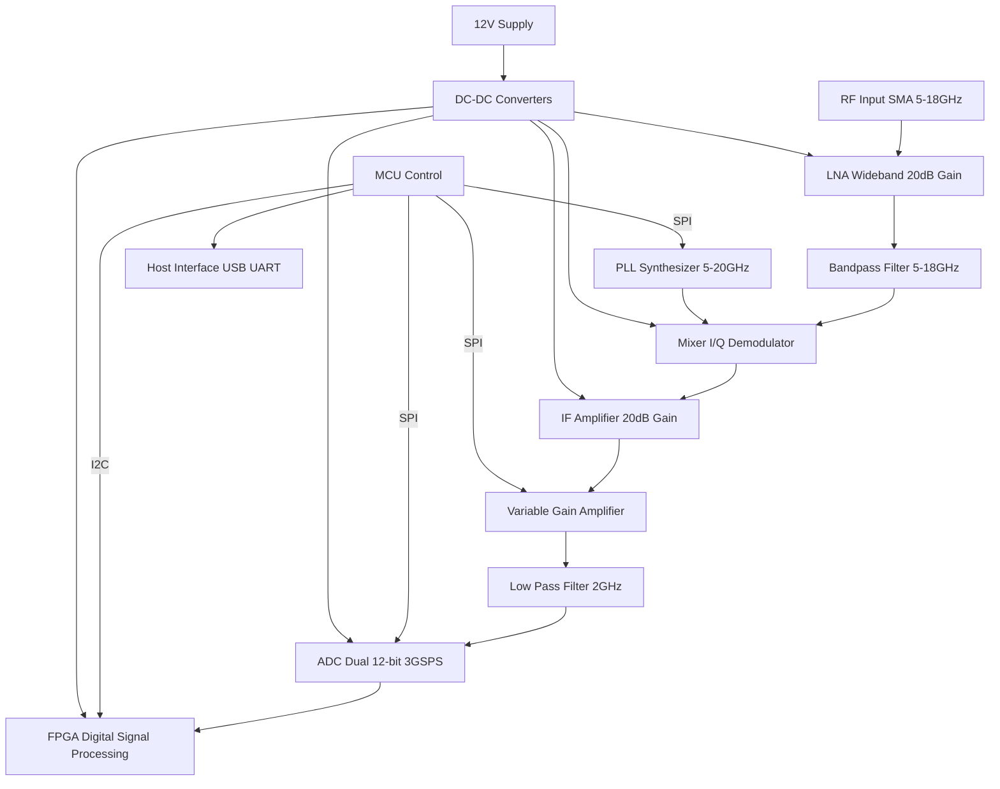

# System Block Diagram
## rx receiver

```mermaid
flowchart TD
    RF_IN[RF Input SMA 5-18GHz] --> LNA[LNA Wideband 20dB Gain]
    LNA --> BPF[Bandpass Filter 5-18GHz]
    BPF --> MIXER[Mixer I/Q Demodulator]
    MIXER --> IF_AMP[IF Amplifier 20dB Gain]
    IF_AMP --> VGA[Variable Gain Amplifier]
    VGA --> LPF[Low Pass Filter 2GHz]
    LPF --> ADC[ADC Dual 12-bit 3GSPS]
    ADC --> FPGA[FPGA Digital Signal Processing]
    
    LO_SRC[PLL Synthesizer 5-20GHz] --> MIXER
    MCU[MCU Control] -->|SPI| LO_SRC
    MCU -->|SPI| VGA
    MCU -->|SPI| ADC
    MCU -->|I2C| FPGA
    
    PWR_12V[12V Supply] --> DC_DC[DC-DC Converters]
    DC_DC --> LNA
    DC_DC --> MIXER
    DC_DC --> IF_AMP
    DC_DC --> ADC
    DC_DC --> FPGA
    
    MCU --> HOST[Host Interface USB UART]
```
