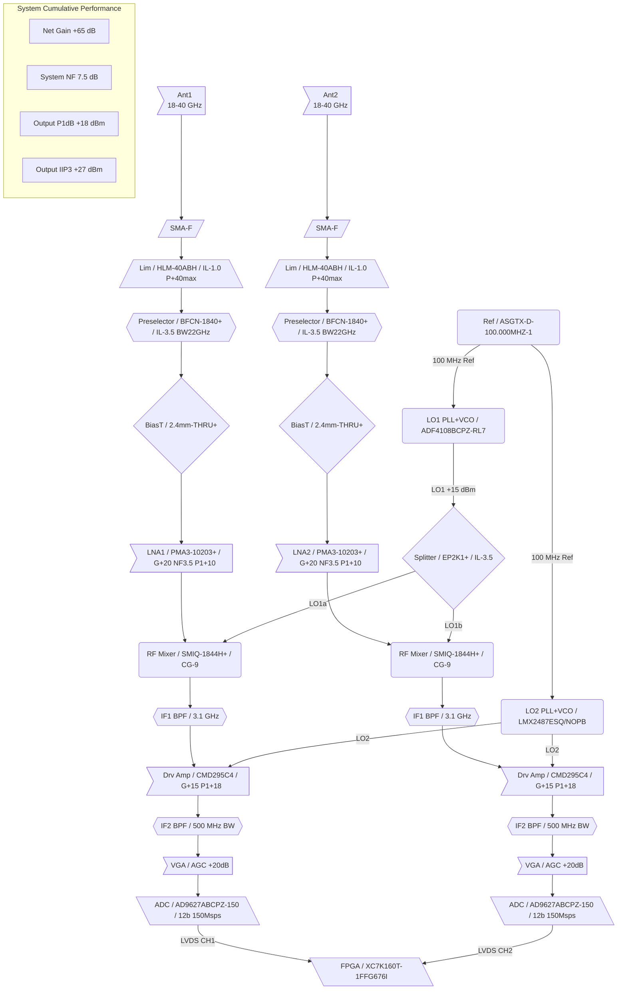

# System Block Diagram
## hv

```mermaid
flowchart TD
    ANT1>"Ant1<br/>18-40 GHz"]
    ANT2>"Ant2<br/>18-40 GHz"]
    SMA1[/"SMA-F"/]
    SMA2[/"SMA-F"/]
    LIM1[/"Lim / HLM-40ABH / IL-1.0 P+40max"\]
    LIM2[/"Lim / HLM-40ABH / IL-1.0 P+40max"\]
    BPF1{{"Preselector / BFCN-1840+ / IL-3.5 BW22GHz"}}
    BPF2{{"Preselector / BFCN-1840+ / IL-3.5 BW22GHz"}}
    BT1{"BiasT / 2.4mm-THRU+"}
    BT2{"BiasT / 2.4mm-THRU+"}
    LNA1>"LNA1 / PMA3-10203+ / G+20 NF3.5 P1+10"]
    LNA2>"LNA2 / PMA3-10203+ / G+20 NF3.5 P1+10"]
    SPLIT{"Splitter / EP2K1+ / IL-3.5"}
    MIX1("RF Mixer / SMIQ-1844H+ / CG-9")
    MIX2("RF Mixer / SMIQ-1844H+ / CG-9")
    IF1BPF1{{"IF1 BPF / 3.1 GHz"}}
    IF1BPF2{{"IF1 BPF / 3.1 GHz"}}
    DA1>"Drv Amp / CMD295C4 / G+15 P1+18"]
    DA2>"Drv Amp / CMD295C4 / G+15 P1+18"]
    IF2BPF1{{"IF2 BPF / 500 MHz BW"}}
    IF2BPF2{{"IF2 BPF / 500 MHz BW"}}
    VGA1>"VGA / AGC +20dB"]
    VGA2>"VGA / AGC +20dB"]
    ADC1[\"ADC / AD9627ABCPZ-150 / 12b 150Msps"\]
    ADC2[\"ADC / AD9627ABCPZ-150 / 12b 150Msps"\]
    FPGA[\"FPGA / XC7K160T-1FFG676I"\]
    LO1("LO1 PLL+VCO / ADF4108BCPZ-RL7")
    LO2("LO2 PLL+VCO / LMX2487ESQ/NOPB")
    TCXO("Ref / ASGTX-D-100.000MHZ-1")
    C_G["Net Gain +65 dB"]
    C_NF["System NF 7.5 dB"]
    C_P1["Output P1dB +18 dBm"]
    C_IP3["Output IIP3 +27 dBm"]
    ANT1 --> SMA1
    SMA1 --> LIM1
    LIM1 --> BPF1
    BPF1 --> BT1
    BT1 --> LNA1
    LNA1 --> MIX1
    MIX1 --> IF1BPF1
    IF1BPF1 --> DA1
    DA1 --> IF2BPF1
    IF2BPF1 --> VGA1
    VGA1 --> ADC1
    ANT2 --> SMA2
    SMA2 --> LIM2
    LIM2 --> BPF2
    BPF2 --> BT2
    BT2 --> LNA2
    LNA2 --> MIX2
    MIX2 --> IF1BPF2
    IF1BPF2 --> DA2
    DA2 --> IF2BPF2
    IF2BPF2 --> VGA2
    VGA2 --> ADC2
    ADC1 -->|LVDS CH1| FPGA
    ADC2 -->|LVDS CH2| FPGA
    LO1 -->|LO1 +15 dBm| SPLIT
    SPLIT -->|LO1a| MIX1
    SPLIT -->|LO1b| MIX2
    LO2 -->|LO2| DA1
    LO2 -->|LO2| DA2
    TCXO -->|100 MHz Ref| LO1
    TCXO -->|100 MHz Ref| LO2
    subgraph CASCADE["System Cumulative Performance"]
        C_G
        C_NF
        C_P1
        C_IP3
    end
```
