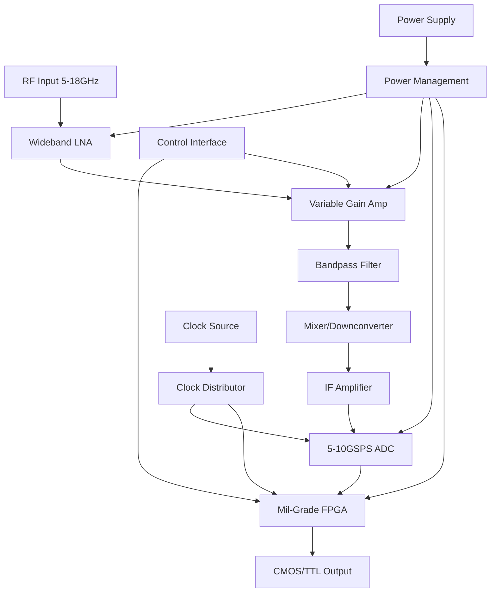

# System Block Diagram
## Sample Ai Project

```mermaid
flowchart TD
    RF_IN["RF Input 5-18GHz"] --> LNA["Wideband LNA"]
    LNA --> VGA["Variable Gain Amp"]
    VGA --> BPF["Bandpass Filter"]
    BPF --> MIX["Mixer/Downconverter"]
    MIX --> IF_AMP["IF Amplifier"]
    IF_AMP --> ADC["5-10GSPS ADC"]
    ADC --> FPGA["Mil-Grade FPGA"]
    FPGA --> DOUT["CMOS/TTL Output"]
    CLK["Clock Source"] --> CLK_DIST["Clock Distributor"]
    CLK_DIST --> ADC
    CLK_DIST --> FPGA
    PWR["Power Supply"] --> PWR_MGMT["Power Management"]
    PWR_MGMT --> LNA
    PWR_MGMT --> VGA
    PWR_MGMT --> ADC
    PWR_MGMT --> FPGA
    CTRL["Control Interface"] --> FPGA
    CTRL --> VGA
```
