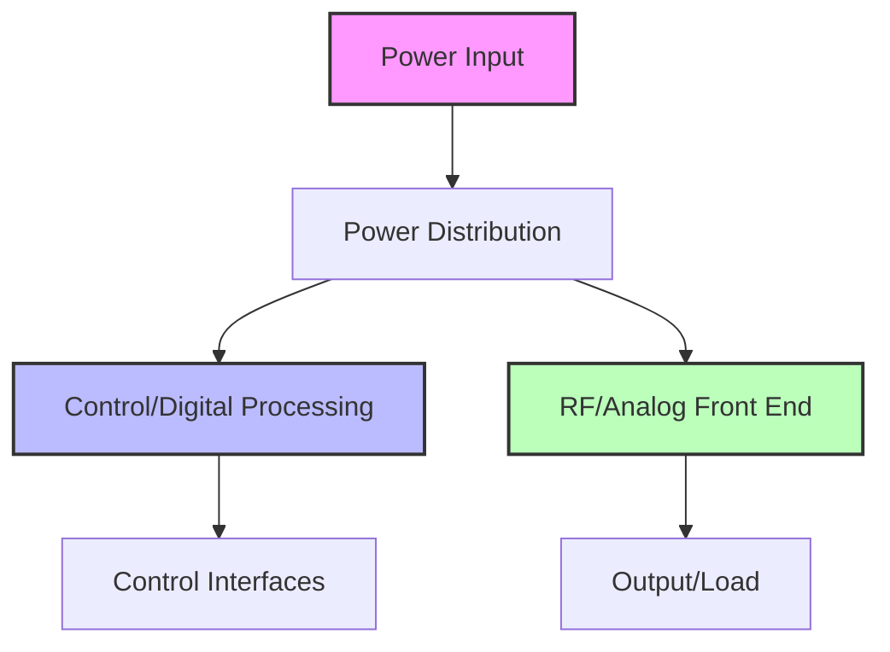

# System Block Diagram
## rx module

```mermaid
graph TD
    PWR[Power Input] --> PWR_DIST[Power Distribution]
    PWR_DIST --> MCU[Control/Digital Processing]
    PWR_DIST --> RF[RF/Analog Front End]
    MCU --> CTRL[Control Interfaces]
    RF --> OUT[Output/Load]
    style PWR fill:#f9f,stroke:#333,stroke-width:2px
    style MCU fill:#bbf,stroke:#333,stroke-width:2px
    style RF fill:#bfb,stroke:#333,stroke-width:2px
```
