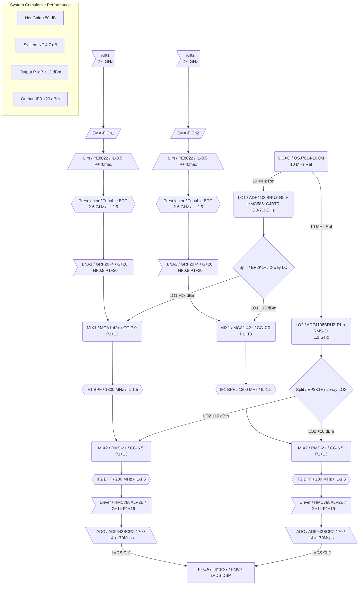

# System Block Diagram
## hjjg

```mermaid
flowchart TD
    ANT1>"Ant1<br/>2-6 GHz"]
    ANT2>"Ant2<br/>2-6 GHz"]
    SMA1[/"SMA-F Ch1"/]
    SMA2[/"SMA-F Ch2"/]
    LIM1[/"Lim / PE8022 / IL-0.5 P+40max"\]
    LIM2[/"Lim / PE8022 / IL-0.5 P+40max"\]
    BPF1{{"Preselector / Tunable BPF 2-6 GHz / IL-2.5"}}
    BPF2{{"Preselector / Tunable BPF 2-6 GHz / IL-2.5"}}
    LNA1>"LNA1 / GRF2074 / G+20 NF0.8 P1+20"]
    LNA2>"LNA2 / GRF2074 / G+20 NF0.8 P1+20"]
    MIX1A("MIX1 / MCA1-42+ / CG-7.0 P1+13")
    MIX2A("MIX2 / RMS-2+ / CG-6.5 P1+13")
    MIX1B("MIX1 / MCA1-42+ / CG-7.0 P1+13")
    MIX2B("MIX2 / RMS-2+ / CG-6.5 P1+13")
    IF1F1{{"IF1 BPF / 1300 MHz / IL-1.5"}}
    IF1F2{{"IF1 BPF / 1300 MHz / IL-1.5"}}
    IF2F1{{"IF2 BPF / 200 MHz / IL-1.5"}}
    IF2F2{{"IF2 BPF / 200 MHz / IL-1.5"}}
    DRV1>"Driver / HMC788ALP2E / G+14 P1+19"]
    DRV2>"Driver / HMC788ALP2E / G+14 P1+19"]
    ADC1[\"ADC / AD9643BCPZ-170 / 14b 170Msps"\]
    ADC2[\"ADC / AD9643BCPZ-170 / 14b 170Msps"\]
    FPGA["FPGA / Kintex-7 / FMC+ LVDS DSP"]
    SP1{"Split / EP2K1+ / 2-way LO"}
    SP2{"Split / EP2K1+ / 2-way LO2"}
    LO1("LO1 / ADF4106BRUZ-RL + HMC586LC4BTR<br/>3.3-7.3 GHz")
    LO2("LO2 / ADF4106BRUZ-RL + RMS-2+<br/>1.1 GHz")
    REF("OCXO / OSJ7014-10.0M<br/>10 MHz Ref")
    CG["Net Gain +50 dB"]
    CNF["System NF 4.7 dB"]
    CP1["Output P1dB +12 dBm"]
    CIP3["Output IIP3 +20 dBm"]
    ANT1 --> SMA1
    ANT2 --> SMA2
    SMA1 --> LIM1
    SMA2 --> LIM2
    LIM1 --> BPF1
    LIM2 --> BPF2
    BPF1 --> LNA1
    BPF2 --> LNA2
    LNA1 --> MIX1A
    LNA2 --> MIX1B
    MIX1A --> IF1F1
    MIX1B --> IF1F2
    IF1F1 --> MIX2A
    IF1F2 --> MIX2B
    MIX2A --> IF2F1
    MIX2B --> IF2F2
    IF2F1 --> DRV1
    IF2F2 --> DRV2
    DRV1 --> ADC1
    DRV2 --> ADC2
    ADC1 -- "LVDS Ch1" --> FPGA
    ADC2 -- "LVDS Ch2" --> FPGA
    REF -- "10 MHz Ref" --> LO1
    REF -- "10 MHz Ref" --> LO2
    LO1 --> SP1
    SP1 -- "LO1 +13 dBm" --> MIX1A
    SP1 -- "LO1 +13 dBm" --> MIX1B
    LO2 --> SP2
    SP2 -- "LO2 +10 dBm" --> MIX2A
    SP2 -- "LO2 +10 dBm" --> MIX2B
    subgraph CASCADE["System Cumulative Performance"]
        CG
        CNF
        CP1
        CIP3
    end
```
