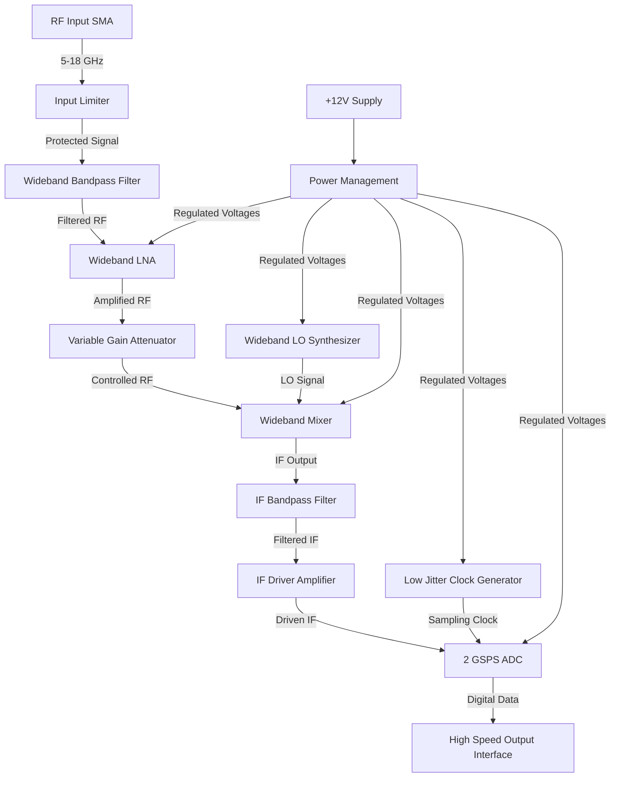

# System Block Diagram
## kb

```mermaid
flowchart TD
    A[RF Input SMA] -->|5-18 GHz| B[Input Limiter]
    B -->|Protected Signal| C[Wideband Bandpass Filter]
    C -->|Filtered RF| D[Wideband LNA]
    D -->|Amplified RF| E[Variable Gain Attenuator]
    E -->|Controlled RF| F[Wideband Mixer]
    G[Wideband LO Synthesizer] -->|LO Signal| F
    F -->|IF Output| H[IF Bandpass Filter]
    H -->|Filtered IF| I[IF Driver Amplifier]
    I -->|Driven IF| J[2 GSPS ADC]
    K[Low Jitter Clock Generator] -->|Sampling Clock| J
    J -->|Digital Data| L[High Speed Output Interface]
    M[+12V Supply] --> N[Power Management]
    N -->|Regulated Voltages| D
    N -->|Regulated Voltages| F
    N -->|Regulated Voltages| G
    N -->|Regulated Voltages| J
    N -->|Regulated Voltages| K
```
