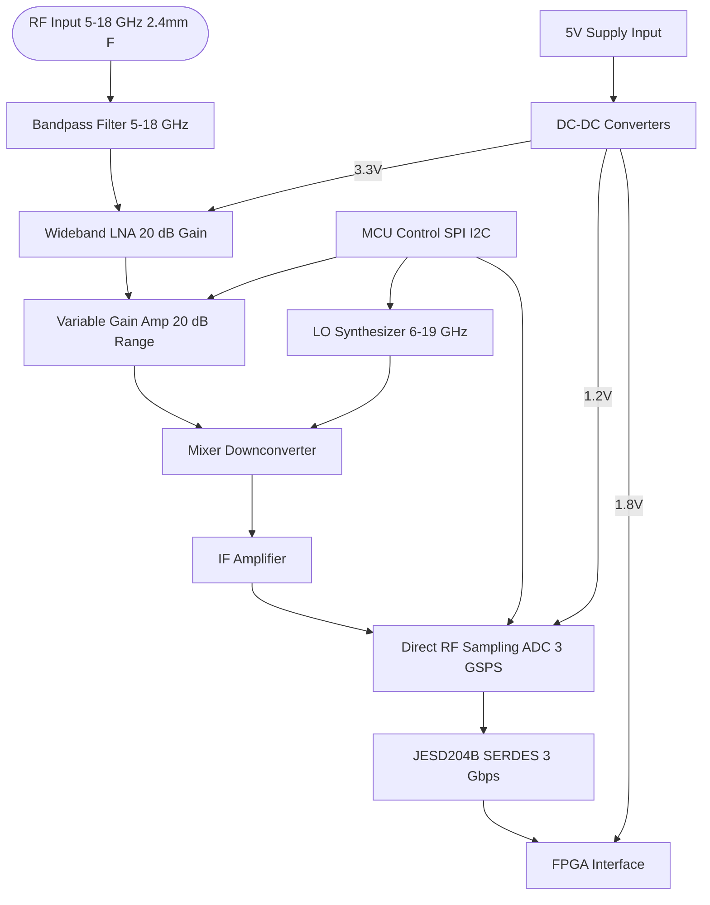

# System Block Diagram
## sdfjbks

```mermaid
flowchart TD
    RF_IN([RF Input 5-18 GHz 2.4mm F]) --> BPF1[Bandpass Filter 5-18 GHz]
    BPF1 --> LNA[Wideband LNA 20 dB Gain]
    LNA --> VGA[Variable Gain Amp 20 dB Range]
    VGA --> MIXER[Mixer Downconverter]
    LO[LO Synthesizer 6-19 GHz] --> MIXER
    MIXER --> IF_AMP[IF Amplifier]
    IF_AMP --> ADC[Direct RF Sampling ADC 3 GSPS]
    ADC --> JESD[JESD204B SERDES 3 Gbps]
    JESD --> FPGA_INT[FPGA Interface]
    CTRL[MCU Control SPI I2C] --> LO
    CTRL --> VGA
    CTRL --> ADC
    PWR_5V[5V Supply Input] --> DC_DC[DC-DC Converters]
    DC_DC -->|1.2V| ADC
    DC_DC -->|3.3V| LNA
    DC_DC -->|1.8V| FPGA_INT
```
