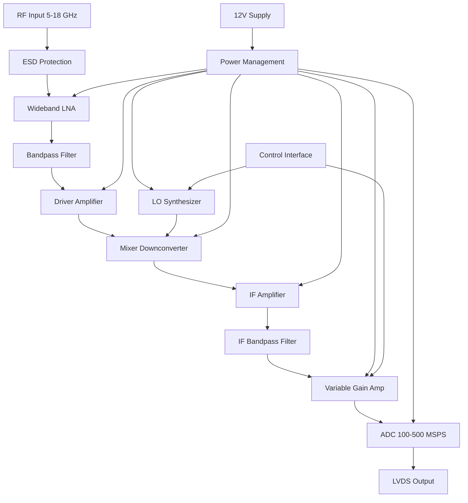

# System Block Diagram
## dfbvd

```mermaid
flowchart TD
    RF_IN[RF Input 5-18 GHz] --> ESD[ESD Protection]
    ESD --> LNA[Wideband LNA]
    LNA --> BPF1[Bandpass Filter]
    BPF1 --> AMP1[Driver Amplifier]
    AMP1 --> MIXER[Mixer Downconverter]
    MIXER --> IF_AMP[IF Amplifier]
    IF_AMP --> BPF2[IF Bandpass Filter]
    BPF2 --> VGA[Variable Gain Amp]
    VGA --> ADC[ADC 100-500 MSPS]
    ADC --> LVDS[LVDS Output]
    
    LO[LO Synthesizer] --> MIXER
    PWR[12V Supply] --> PWR_MGMT[Power Management]
    PWR_MGMT --> LNA
    PWR_MGMT --> AMP1
    PWR_MGMT --> MIXER
    PWR_MGMT --> IF_AMP
    PWR_MGMT --> VGA
    PWR_MGMT --> ADC
    PWR_MGMT --> LO
    
    CTRL[Control Interface] --> VGA
    CTRL --> LO
```
