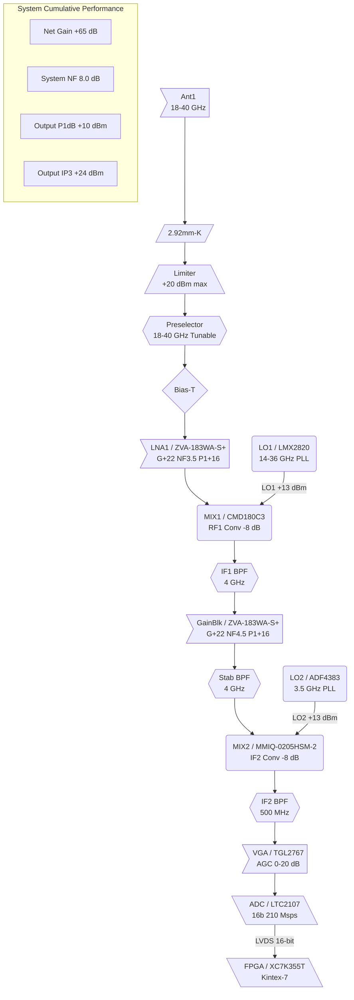

# System Block Diagram
## rx band

```mermaid
flowchart TD
    ANT1>"Ant1<br/>18-40 GHz"]
    SMA1[/"2.92mm-K"/]
    LIM1[/"Limiter<br/>+20 dBm max"\]
    BPF1{{"Preselector<br/>18-40 GHz Tunable"}}
    BT1{"Bias-T"}
    LNA1>"LNA1 / ZVA-183WA-S+<br/>G+22 NF3.5 P1+16"]
    MIX1("MIX1 / CMD180C3<br/>RF1 Conv -8 dB")
    LO1("LO1 / LMX2820<br/>14-36 GHz PLL")
    BPF2{{"IF1 BPF<br/>4 GHz"}}
    GB1>"GainBlk / ZVA-183WA-S+<br/>G+22 NF4.5 P1+16"]
    BPF3{{"Stab BPF<br/>4 GHz"}}
    MIX2("MIX2 / MMIQ-0205HSM-2<br/>IF2 Conv -8 dB")
    LO2("LO2 / ADF4383<br/>3.5 GHz PLL")
    BPF4{{"IF2 BPF<br/>500 MHz"}}
    VGA1>"VGA / TGL2767<br/>AGC 0-20 dB"]
    ADC1[\"ADC / LTC2107<br/>16b 210 Msps"\]
    FPGA1[\"FPGA / XC7K355T<br/>Kintex-7"\]
    CG["Net Gain +65 dB"]
    CNF["System NF 8.0 dB"]
    CP1["Output P1dB +10 dBm"]
    CIP3["Output IP3 +24 dBm"]
    ANT1 --> SMA1
    SMA1 --> LIM1
    LIM1 --> BPF1
    BPF1 --> BT1
    BT1 --> LNA1
    LNA1 --> MIX1
    LO1 -->|LO1 +13 dBm| MIX1
    MIX1 --> BPF2
    BPF2 --> GB1
    GB1 --> BPF3
    BPF3 --> MIX2
    LO2 -->|LO2 +13 dBm| MIX2
    MIX2 --> BPF4
    BPF4 --> VGA1
    VGA1 --> ADC1
    ADC1 -->|LVDS 16-bit| FPGA1
    subgraph CASCADE["System Cumulative Performance"]
        CG
        CNF
        CP1
        CIP3
    end
```
