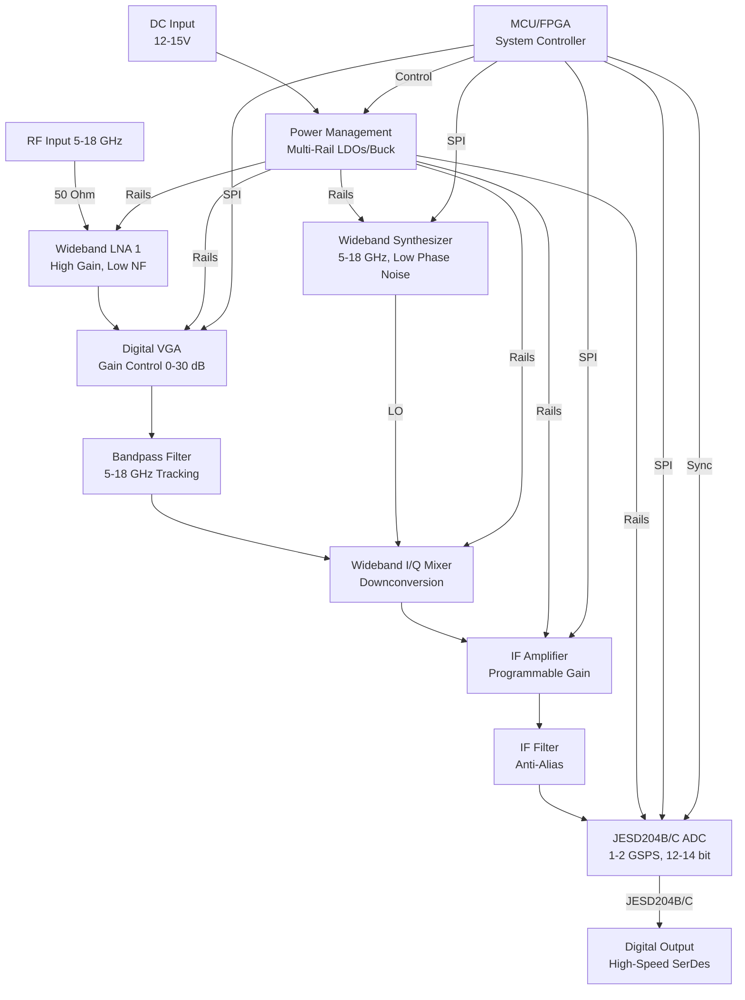

# System Block Diagram
## khgk

```mermaid
flowchart TD
    RF_IN["RF Input 5-18 GHz"] -->|50 Ohm| LNA1["Wideband LNA 1\nHigh Gain, Low NF"]
    LNA1 --> VGA["Digital VGA\nGain Control 0-30 dB"]
    VGA --> FILTER["Bandpass Filter\n5-18 GHz Tracking"]
    FILTER --> MIXER["Wideband I/Q Mixer\nDownconversion"]
    
    SYNTH["Wideband Synthesizer\n5-18 GHz, Low Phase Noise"] -->|LO| MIXER
    
    MIXER --> IF_AMP["IF Amplifier\nProgrammable Gain"]
    IF_AMP --> IF_FILTER["IF Filter\nAnti-Alias"]
    IF_FILTER --> ADC["JESD204B/C ADC\n1-2 GSPS, 12-14 bit"]
    
    PWR["DC Input\n12-15V"] --> PWR_MGMT["Power Management\nMulti-Rail LDOs/Buck"]
    PWR_MGMT -->|Rails| LNA1
    PWR_MGMT -->|Rails| VGA
    PWR_MGMT -->|Rails| MIXER
    PWR_MGMT -->|Rails| SYNTH
    PWR_MGMT -->|Rails| IF_AMP
    PWR_MGMT -->|Rails| ADC
    
    CTRL["MCU/FPGA\nSystem Controller"] -->|SPI| VGA
    CTRL -->|SPI| SYNTH
    CTRL -->|SPI| IF_AMP
    CTRL -->|SPI| ADC
    CTRL -->|Sync| ADC
    
    ADC -->|JESD204B/C| JESD_OUT["Digital Output\nHigh-Speed SerDes"]
    
    CTRL -->|Control| PWR_MGMT
```
