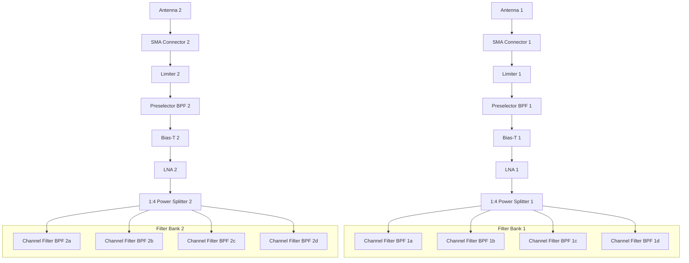

# System Block Diagram
## hh

```mermaid
flowchart TD
    A[Antenna 1] --> B[SMA Connector 1]
    B --> C[Limiter 1]
    C --> D[Preselector BPF 1]
    D --> E[Bias-T 1]
    E --> F[LNA 1]
    F --> G[1:4 Power Splitter 1]
    G --> H[Channel Filter BPF 1a]
    G --> I[Channel Filter BPF 1b]
    G --> J[Channel Filter BPF 1c]
    G --> K[Channel Filter BPF 1d]
    
    L[Antenna 2] --> M[SMA Connector 2]
    M --> N[Limiter 2]
    N --> O[Preselector BPF 2]
    O --> P[Bias-T 2]
    P --> Q[LNA 2]
    Q --> R[1:4 Power Splitter 2]
    R --> S[Channel Filter BPF 2a]
    R --> T[Channel Filter BPF 2b]
    R --> U[Channel Filter BPF 2c]
    R --> V[Channel Filter BPF 2d]
    
    subgraph Filter Bank 1
        H
        I
        J
        K
    end
    
    subgraph Filter Bank 2
        S
        T
        U
        V
    end
```
