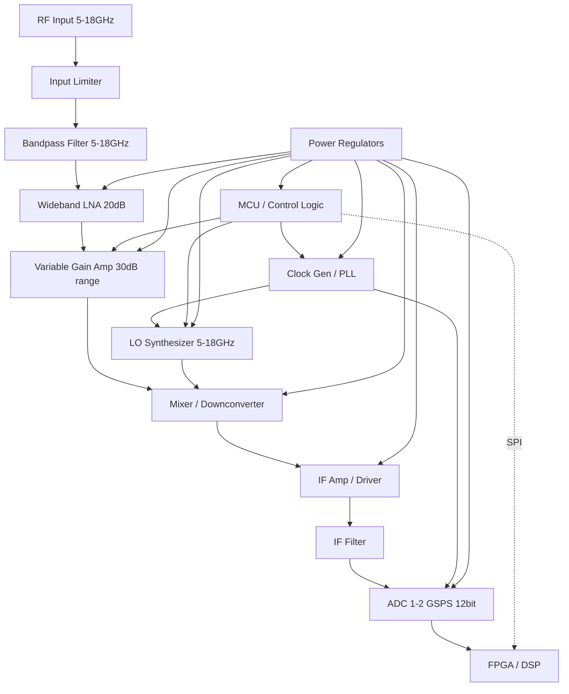

# System Block Diagram
## rf txrxxp

```mermaid
graph TD
    RF_IN["RF Input 5-18GHz"]
    LIM["Input Limiter"]
    BPF1["Bandpass Filter 5-18GHz"]
    LNA["Wideband LNA 20dB"]
    VGA["Variable Gain Amp 30dB range"]
    MXR["Mixer / Downconverter"]
    LO_SYN["LO Synthesizer 5-18GHz"]
    IF_AMP["IF Amp / Driver"]
    IF_FILT["IF Filter"]
    ADC["ADC 1-2 GSPS 12bit"]
    CLK["Clock Gen / PLL"]
    FPGA["FPGA / DSP"]
    CTRL["MCU / Control Logic"]
    PWR["Power Regulators"]
    
    RF_IN --> LIM
    LIM --> BPF1
    BPF1 --> LNA
    LNA --> VGA
    VGA --> MXR
    LO_SYN --> MXR
    MXR --> IF_AMP
    IF_AMP --> IF_FILT
    IF_FILT --> ADC
    CLK --> ADC
    CLK --> LO_SYN
    ADC --> FPGA
    CTRL --> VGA
    CTRL --> LO_SYN
    CTRL --> CLK
    PWR --> LNA
    PWR --> VGA
    PWR --> MXR
    PWR --> LO_SYN
    PWR --> IF_AMP
    PWR --> ADC
    PWR --> CTRL
    PWR --> CLK
    
    CTRL -.->|"SPI"| FPGA
```
