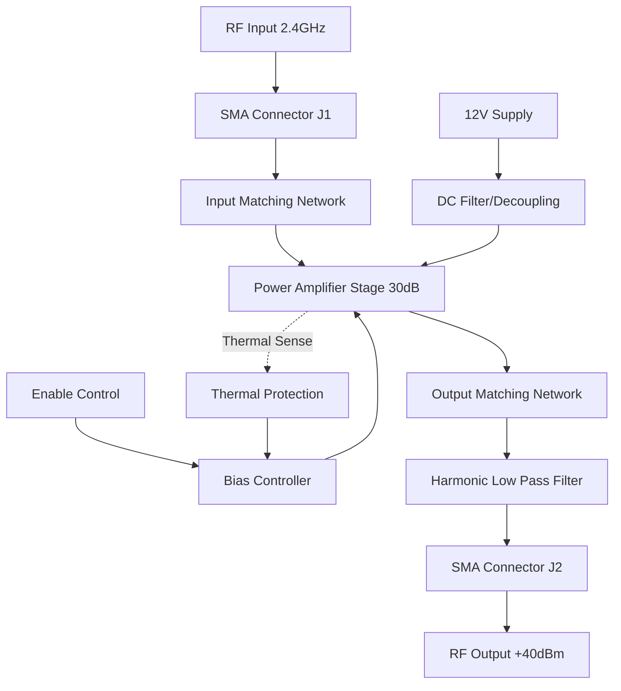

# System Block Diagram
## tf

```mermaid
graph TD
    RF_IN[RF Input 2.4GHz] --> SMA_J1[SMA Connector J1]
    SMA_J1 --> MATCH_IN[Input Matching Network]
    MATCH_IN --> PA_STAGE[Power Amplifier Stage 30dB]
    CTRL_IN[Enable Control] --> BIAS[Bias Controller]
    BIAS --> PA_STAGE
    DC_12V[12V Supply] --> REG_DC[DC Filter/Decoupling]
    REG_DC --> PA_STAGE
    PA_STAGE --> MATCH_OUT[Output Matching Network]
    MATCH_OUT --> LOWPASS[Harmonic Low Pass Filter]
    LOWPASS --> SMA_J2[SMA Connector J2]
    SMA_J2 --> RF_OUT[RF Output +40dBm]
    PA_STAGE -.->|Thermal Sense| THERM[Thermal Protection]
    THERM --> BIAS
```
