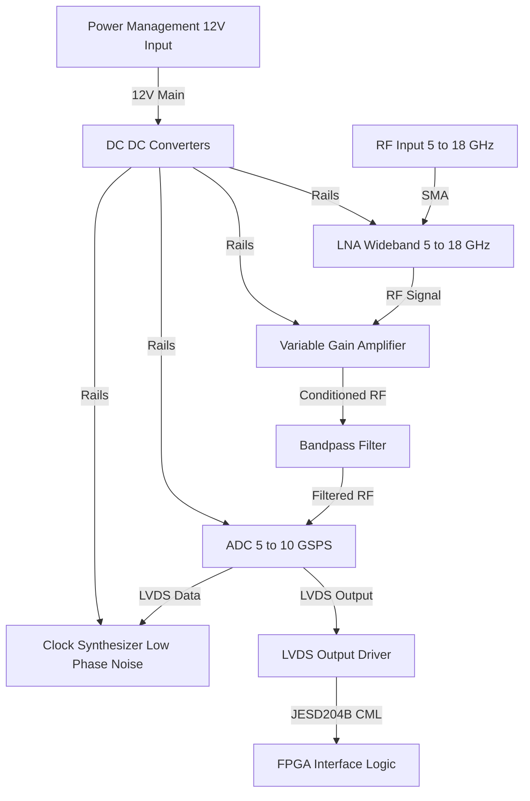

# System Block Diagram
## khv

```mermaid
flowchart TD
    RF_IN[RF Input 5 to 18 GHz] -->|SMA| LNA[LNA Wideband 5 to 18 GHz]
    LNA -->|RF Signal| VGA[Variable Gain Amplifier]
    VGA -->|Conditioned RF| BPF[Bandpass Filter]
    BPF -->|Filtered RF| ADC[ADC 5 to 10 GSPS]
    ADC -->|LVDS Data| CLK[Clock Synthesizer Low Phase Noise]
    ADC -->|LVDS Output| DIO[LVDS Output Driver]
    DIO -->|JESD204B CML| FPGA[FPGA Interface Logic]
    PWR[Power Management 12V Input] -->|12V Main| DCDC[DC DC Converters]
    DCDC -->|Rails| LNA
    DCDC -->|Rails| VGA
    DCDC -->|Rails| ADC
    DCDC -->|Rails| CLK
```
